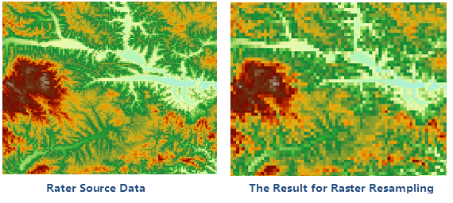

### Introduction

Create a new raster dataset and assign the cell value or deduction value of
original raster dataset to the pixel of new raster dataset.

### Basic Steps

1. Click the ribbon Data processing in the Data tab, and the Resample button on Raster group. Pop up the following "Resample" dialog box. 
2. Users should set the following parameters. 

### Source Data

* Datasource: List all the datasources in current workspace and select the datasources that the datasets needed to resample belong to.
* Dataset: List all the raster datasets in current datasource, including raster dataset (GRID) and image dataset (IMAGE). Select the datasets that need to resample, and here it will locate to the dataset selected in the workspace manager. Note: The raster data resample doesn't support the multiband image data.

### Result Data

* Datasource: List all the datasources in current workspace and select the datasource that contains the result datasets. It is the same with source datasource by default.
* Dataset: Set the name of result dataset and the result dataset is the same as the source dataset.

### Parameter Settings

* Resample Mode: SuperMap provides three resample methods: Nearest, Bilinear and Cubic.

**Nearest** : Take the nearest cell value in input raster dataset as the input
value and assign it to the corresponding cell in export raster dataset. This
method won't change the original cell value and it is fast. It is applicable
to the discrete data representing classify or special, such as landuse,
vegetation type and so on.

**Bilinear** : Assign the weighted average of the four nearest cell values in
the input raster dataset to the corresponding cell in export raster dataset.
This result is more smoother than the nearest method, but it will change the
original raster value. It is applicable to the continuous data representing
phenomenon distribution and landform surface, such as DEM, rainfall
distribution. slope and so on.

**Cubic** : It is similar to the bilinear. Assign the weighted average of the
16 nearest cell values in the input raster dataset to the corresponding cell
in export raster dataset.This method is the most clear, but the border of the
raster data has sharpening effect. The calculation is large and processing
time is long. It is applicable to the resampling of air photos and remote
sensing image.

* Resolution:Set the resolution of the export dataset. The default resolution is the twice of the input dataset.
* Columns: The pixel column of export raster dataset. You can't manual modify it and it controlled by the "Resolution" parameter. The default is the same as the column of input raster dataset.
* Rows: The pixel row of export raster dataset. You can't manual modify it and it controlled by the "Resolution" parameter. The default is the same as the row of input raster dataset.
* Batch Resample to all Grid in the Data Source: Check the checkbox, the application will batch resampling all the rasters and image datasets in the datasource according to the relevant parameters.
* Click "Environment Settings" button to open the "Environment Setting for Raster Analysis" where you can set the analysis parameters to values as needed. For detail operations, please refer to [Setting the Analysis Environment](../../Raster/AnalystEnvironment). 

Note: you are allowed to specify the environment parameters as global
variables, then you do not need to set the parameters again in other
operations. Also the system can read parameter values specified in the raster
analysis environment if you do not set parameters here.

* After finished the parameter settings, click "OK" button to execute raster resample operation.

