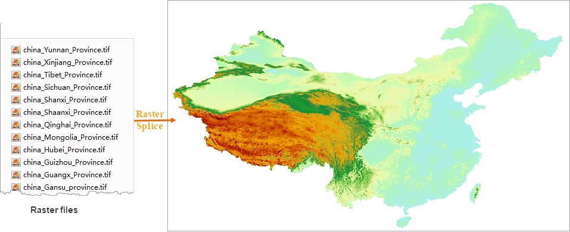

### Function Introduction

Merge multiple raster files or image files in bulk resulting in a dataset.

### Function Principle

The program will create an empty image/raster dataset which has the same
coordinate system, pixel format, and band count as source data. The bounds of
the dataset are the union of bounds of all inputs. The inputs will be appended
to the empty dataset.

### Application Scenarios

The feature can be used for merging pictures photographed by drones or remote-
sensing images to improve the image processing efficiency.

### Function Entrance

Click **Data** > **Data Processing** > **Raster** > **Raster Splice**.

### Parameter Description

* **Data Type** : the feature can be worked on image or raster data. All inputs to be merged should be in the same type. Therefore, we should specify the data type before adding data. Raster is by default.
* **Add File** : click on the icon button and select raster or image files.
  * All inputs should use the same coordinate systems.
  * All pixel formats of all inputs should be consistent.
  * For image data, all inputs should have the same band counts.
* **Encode Type** : 
* **Encode Type** : specify the encode type of your resulting dataset including SGL, DCT, LZW, PNG, and compound encoding. None is by default. For specific information on encoding, please refer to [Dataset Encoding Types](../../DataProcessing/DataManagement/EncodeType).

**Application Example**

Given DEM raster data files of 34 provinces which use the same coordinate
systems and in the same pixel formats, we got the following picture by using
the feature to merge them.

  
