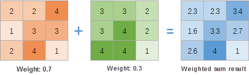
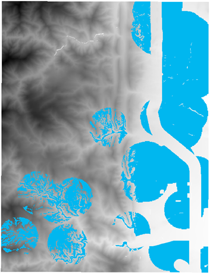

### Function description

Overlays multiple raster datasets according to a certain weight. iDesktop will
create a new raster dataset to save the overlay result. The theory is that
each grid value multiplies the corresponding weight first, and then adding all
grid values in the same position. As the following picture shows, taking the
first grid as an example, the result grid value is 2.3 (2*0.7+3*0.3=2.3).

  

  
**Applicable data** : raster

### Application scenarios

* Analyze the suitability of vegetation and crops.
* Select addresses to build schools, parks, and so on.

### Function entrance

Click the **Data** tab > **Data Processing** group > **Weighted Sum** button.

### Parameter Specification

* **Add** : Click the icon in the toolbar to head to the dialog Select where you can specify raster datasets. 
  * All specified raster datasets must use the same coordinate system.
  * Pixel formats could be float, integer, unsigned, and inconsistent. 
* **Weight** : In the column Weight, set each weight to an appropriate value which can be positive, negative, integer, and float. The sum of all weights could be any value. Such as when analyzing whether a terrain is suitable for crops, we can set the sunshine weight to 0.5 (50%), the slope weight to 0.2 (20%), and the aspect weight to 0.3 (30%). 
* **Pixel Format** : The pixel format of the first raster dataset is by default. Also you can choose one from provided 11 formats. For information about pixel formats, please refer to [Grid Dataset Pixel Format](../../Analyst/VectorRasterConvert/PixelFormat).
* **Compress Dataset** : Check the checkbox to compress the result dataset.
* **Ignore NoValue Cells** : Check the box to exclude NoValue cells from the operation. The values of the result grids are NoValue (-9999 generally) in the corresponding position. If you don't check it, all Novalue cells will be considered as normal grids for the operation, that will change extreme values.
* **Environment Settings** : Assign proper values to required parameters. For detail descriptions about each parameter, please refer to [Setting the Analysis Environment](../../Analyst/Raster/AnalystEnvironment).

### Application

We have data on park site selection. Based on the following conditions, select an appropriate site.

* **Terrain** : the slope should be less than 20 degrees.
* **Elevation** : the elevation should be between 1000m and 1800m
* **Distance to the lake** : the distance should be less than 1km.
* **Distance to the street** : the site should be out of the buffer zone of the main street that the buffer distance is 300m.

**Data preparation** : terrain data, lake data, park data, and road data.

**Operation instructions**

1. Slope: Perform the Slope Analysis on terrain data first. Run the Algebraic Operation Con([Slope]<=20, 1, 0) to slope data to assign 1 to the grids whose values are less than or equal to 20 and assign 0 to other grids.
2. Elevation: Perform the Algebraic Operation Con(1000<=[terrain]<=1800,1,0) on terrain data to assign 1 to the grids whose values are between 1000 and 1800 and 0 to other grids.
3. Lake: In the Environment Settings for Raster Analysis dialog box, set the Clip Bounds to terrain data. Then generate distance raster based on lake data. Perform the Algebraic Operation Con( [LakesDis] <= 1000,1,0) on the distance raster to assign 1 to the grids whose values are equal to or less than 1000 and 0 to other grids. 
4. Road: Generate distance raster based on road data. Perform the Algebraic Operation Con( [LakesDis] >= 300,1,0) on the distance raster to assign 1 to the grids whose values are equal to or less than 300 and 0 to other grids.
5. Weighted Sum: Click the Data tab > Data processing group > Weighted Sum button to open the Raster Weighted Sum dialog box. Then add the result raster datasets and specify their weights are 0.3 (slope data), 0.25 (elevation data), 0.2 (lake data), and 0.15 (road data) respectively.
6. Perform the algebraic operation to weighted sum data to assign the grids whose values are equal to or larger than 1 and assign 0 to other grids. Clip the result raster dataset with existing park data and get data out of the range of existing park data. The result grids whose values are larger than 1 compose the proper park site.  

  

  

