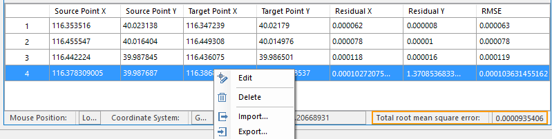

The "Calculate Error" button will be available once the control points are sufficient. You can specify a registration algorithm to calculate errors of all control points.

### Basic steps

  1. **Algorithm** : In the Registration tab on the "Operation" group, four algorithms are provided. You can click Algorithm drop-down list to choose appropriate one from them. The four algorithms have different requirements in number of control points. On registration algorithms, please consult [Introduction of registration algorithms](../../../Features/DataProcessing/Registration/RegistrationMode.htm).
  2. Click Registration tab > "Operation" group > "Calculate Error", and the error of each control point is listed in the control point table including Residual X, Residual Y, root-mean-square error, with the total error (the sum of all root-mean-square errors) in the status bar. On specific implications of registration errors, please refer to [An introduction of registration errors](RegistrationError.htm).  
    

  3. The unit of error is the same with the unit of plane coordinate of current data. Generally, the precision of registration is required less than half of one pixel. For example, if the image resolution is 30 meter, the total root-mean-square error should be less than 15 meter. 
  4. Different projects have different requirements in registration precision. If the root-mean-square error of a control point is greater than the acceptable total root-mean-square error, you can delete or re-edit the control point to reduce the total root-mean-square error thereby improve registration precision.
  5. Adjust the position precision of control points and continue calculating errors until all errors are within the required range of precision.
  6. Right click your mouse anywhere in the control point table, and then select "Export..." to save all control point information as a registration file(*.druf). On the detail operation, please refer to [Import/export a Registration Information File](importGCP.htm).

### Related topics

After all errors are obtained, please execute the next operation [Step 4 Run "Register"](Registrating.htm).