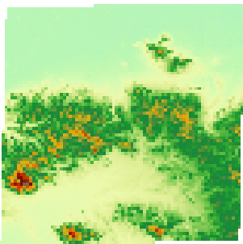

---
id: resamplesize
title: Setting the Pixel Size
---  

### Instructions

The pixel is the basic information unit of the grid/image data, the coordinate position of which is determined by the row number and column number. Each pixel has an attribute value, which represents the position corresponding to the pixel, for example, the DEM grid cell reflects the ground altitude corresponding to the pixel. The pixel size, also called the spatial resolution, is the ground area size corresponding to a single pixel.

For a grid/image data with a fixed spatial ratio, the resample mode can be used to change the pixel size.

The text box on the right side of the Pixel in the Grid/Image Parameter group is used to set the pixel size after resampling.

### Basic Steps

  1. In the Registration tab, in the text box on the right side of the Pixel label in the Grid/Image Parameter group, input the pixel size after resampling. The unit of the pixel size should be consistent with the unit of the projection coordinate system of the layer for which you want to implement the registration.
  2. Implement the registration operation for the grid/image dataset, and check the attribute information of the saved registration result dataset, then you can see that the values of resolution X and resolution Y of the grid/image dataset have changed.

Take the bilinear interpolation method as an example below, resample the grids with a pixel size of 0.00027 in the geographical coordinate system. The pixel size after resampling is 0.013. The following figure is the effect figure after the registration.

 |   
---|---  
Before resampling | After resampling  

### Note

  1. The unit of the pixel size is consistent with the unit of the projection coordinate system. If the coordinate system of the registration layer is the projection coordinate system, the unit is meter, kilometer, foot, etc. If the coordinate system of the registration layer is the geographical coordinate system, the unit is degree, minute, second.
  2. Select a suitable pixel size to resample the grid/image data. A pixel value that is too large will cause a loss of information; and a pixel value that is too small cannot achieve the objective of resampling.