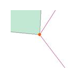

### Introduction

Before carrying out the topology check, it's needed to carry on the topology
preprocessing operation, through the preprocessing to adjust the problem data
in the tolerance range. Without topology preprocessing, there may be an error
in the result of the topology check. The 3D topology preprocessing provides
the node capture processing method, which only supports 3D line datasets
currently.

### Function Entrance

Data > Topology Preprocessing > 3D Topology Preprocessing.
###  Parameter Description
* Tolerance : The tolerance value for the topology preprocessing, which is a distance value, it means that in the range of the value, all the nodes or (and) lines are considered to be identical. For example, if the distance between a line's node and another line's node is in the tolerance range, it is considered that the two nodes coincide; if the distance between a line's node and a point object is in the tolerance range, it is considered that point is on the line. When the distance between the nodes and (or) lines is less than the tolerance value, the topology preprocessing is performed. 

The default tolerance value is related to the coordinate system of the dataset, for details please see [Tolerance Description](../Tolerance).

* Node Snap: the nodes within the tolerance value are put together (the nodes that are put together are set to the same 2D coordinates), where the meaning of "node" is the point object or nodes of the lines or regions. 

After checking the Node Snap check box, you can select a dataset in Reference Data which is taken as the reference points for the snap. After the snapping the points within the tolerance range on the lines or regions will be removed. The effect is shown in the picture below.

 |   
---|---  
 |   
Before the topology preprocessing | After the topology preprocessing  
  3. Click OK to perform the operation.

### Note

This function may change the spatial position of the source dataset. Please make a copy before it.

  

