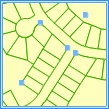
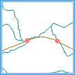
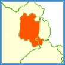
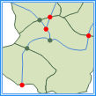

Validate Topology is to return objects in point, line, region dataset that violate the specified topology rule. Validate Topology is usually performed before data editing and topology analysis.

In SuperMap, there are 6 topology rules defined for point datasets, 14 for line datasets, and 10 for region datasets. Besides, there are 5 kinds of topology rules that can be used for different types of topology rule. 

The topology rules used for point, line and region dataset and the rules used for multiple kinds of datasets are introduced below.

 ### The rules used for point dataset

The following rules are appropriate for point datasets.

<table class="normaltable" width="95%">
<thead>
<tr class="normaltableTitle">
	<td width="15%">ID</td>
	<td width="55%">Description</td>
	<td width="30%">Illustration</td>
</tr>
</thead>
<tr class="normaltablecontent2">
	<td>Must Be Covered By Line</td>
    <td>
Requires that points in a point dataset fall on the lines in a line dataset. The points can overlap with the endpoints of the lines. 

    	
The points that are not touched by any line in the line dataset will be returned in the result dataset as errors. 

        
Error dataset type: Point dataset. 
</td>
    <td>&nbsp;&nbsp;</td>
</tr>
<tr class="normaltablecontent1">
	<td>Must Be Covered By Boundary Of Region</td>
    <td>
Requires that points must fall on the boundaries of region objects in a region dataset. 

    	
The points that are not on any boundary in the region dataset will be returned in the result dataset. 

        
Error dataset type: Point dataset.
</td>
    <td>&nbsp;&nbsp;</td>
</tr>
<tr class="normaltablecontent2">
	<td>Must Be Properly Inside Polygons</td>
    <td>
Requires that points must fall within regions in a region dataset. 

    	
The points that are not contained by any region in the region dataset will be returned in the result dataset. 

        
Error dataset type: Point dataset.
</td>
    <td>&nbsp;&nbsp;</td>
</tr>
<tr class="normaltablecontent1">
	<td>Must Be Covered By Endpoint Of Line</td>
    <td>
Requires that points in a point dataset must be covered by the endpoints of lines in a line dataset.

    	
The points in the point dataset that are not covered by any endpoint will be returned in the result dataset. 

        
Error dataset type: Point dataset.
</td>
    <td>&nbsp;&nbsp;</td>
</tr>
<tr class="normaltablecontent2">
	<td>No Identical Points</td>
    <td>
Requires that points in the same point dataset not overlap. 

        
The duplicate points will be returned in the result dataset as errors. 

        
Error dataset type: Point dataset.
</td>
    <td>&nbsp;&nbsp;</td>
</tr>
<tr class="normaltablecontent1">
	<td>Point No Contained By Polygon </td>
    <td>
Requires that points in the point dataset not contained by the interior of any region in the region dataset.

    	
The points contained by the interior of any regions will be returned in the result dataset as errors. 

        
Error dataset type: Point dataset.
</td>
    <td>&nbsp;&nbsp;</td>
</tr>

</table>

  
### The rules used for line dataset

The following rules are appropriate for line datasets.

<table class="normaltable" width="95%">
<thead>
<tr class="normaltableTitle">
	<td width="15%">ID</td>
	<td width="55%">Description</td>
	<td width="30%">Illustration</td>
</tr>
</thead>
<tr class="normaltablecontent2">
	<td>Must Not Intersect With Each Other</td>
    <td>
Requires lines in one line dataset must not intersect with lines in another line dataset.

    	
The intersections will be returned in the result dataset as errors.

        
Error dataset type: Point dataset.
</td>
    <td>&nbsp;&nbsp;</td>
</tr>
<tr class="normaltablecontent1">
	<td>Must Not Intersect Within The Line Itself</td>
    <td>
Requires that line objects in the same line dataset not cross or overlap each other. Lines can share endpoints. 

    	
The intersections will be returned in the result dataset as errors.

        
Error dataset type: Point dataset.
</td>
    <td>&nbsp;&nbsp;</td>
</tr>
<tr class="normaltablecontent2">
	<td>Must Not Self Overlap</td>
    <td>
No self overlap in the same line dataset. Requires that line objects not overlap themselves.

    	
The self overlapped segments will be returned in the result dataset.

        
Error dataset type: Line dataset.
</td>
    <td>&nbsp;&nbsp;</td>
</tr>
<tr class="normaltablecontent1">
	<td>Must Not Have Dangles</td>
    <td>
Requires that a line object must touch lines from the same dataset at both endpoints; otherwise it will be an error. 

    	
Endpoints that are not shared will be returned in the result dataset.

        
Error dataset type: Point dataset.
</td>
    <td>&nbsp;&nbsp;</td>
</tr>
<tr class="normaltablecontent2">
	<td>Must Not Have Pseudo nodes</td>
    <td>
Requires that each shared endpoint must have at least three lines connected to it; otherwise it will be an error. 

    	
Shared endpoints that have only two lines connected to it will be returned as errors in the result dataset. 

        
Error dataset type: Point dataset.
</td>
    <td>&nbsp;&nbsp;</td>
</tr>
<tr class="normaltablecontent1">
	<td>Must Not Overlap With</td>
    <td>
Requires that a line from one dataset not overlap with line(s) in another dataset. 

    	
The self overlapped segments will be returned in the result dataset.

        
Error dataset type: Line dataset.
</td>
    <td>&nbsp;&nbsp;</td>
</tr>
<tr class="normaltablecontent2">
	<td>Must Not Intersect Or Touch Interior</td>
    <td>
Requires that a line in one dataset must only touch other lines of the same dataset at endpoints. 

    	
The intersections will be returned in the result dataset as errors.

        
Error dataset type: Point dataset.
</td>
    <td>&nbsp;&nbsp;</td>
</tr>
<tr class="normaltablecontent1">
	<td>Must Not Self Overlap</td>
    <td>
No self overlap in the same line dataset. Requires that line objects not overlap themselves.

    	
The self overlapped segments will be returned in the result dataset.

        
Error dataset type: Line dataset.
</td>
    <td>&nbsp;&nbsp;</td>
</tr>
<tr class="normaltablecontent2">
	<td>Must Not Self Intersect</td>
    <td>
Line can not intersect with themselves. Requires that line objects not cross or overlap themselves.

    	
The self intersection points and the vertices of the self overlapped line segments will be returned as errors in the result dataset. 

        
Error dataset type: Point dataset.
</td>
    <td>&nbsp;&nbsp;</td>
</tr>
<tr class="normaltablecontent1">
	<td>Must Be Covered By Lines Of</td>
    <td>
Requires that lines from one dataset be covered by the lines in another dataset. 

    	
Lines or line segments in other dataset that are not covered by any line in the other dataset will be returned as errors in the result dataset. 

        
Error dataset type: Line dataset.
</td>
    <td>&nbsp;&nbsp;</td>
</tr>
<tr class="normaltablecontent2">
	<td>Must Be Covered By Boundary Of</td>
    <td>
Requires that lines in the line dataset must be covered by boundaries of regions in the region dataset.

    	
Lines or line segments in the line dataset that are not covered by any boundary in the region dataset will be returned in the result dataset as errors

        
Error dataset type: Line dataset.
</td>
    <td>&nbsp;&nbsp;</td>
</tr>
<tr class="normaltablecontent1">
	<td>Endpoint Must Be Covered By</td>
    <td>
Requires that the endpoints of lines in a line dataset must be covered by points in a point dataset.

    	
The endpoints that are not covered by any point in the point dataset will be returned in the result dataset as errors. 

        
Error dataset type: Point dataset.
</td>
    <td>&nbsp;&nbsp;</td>
</tr>
<tr class="normaltablecontent2">
	<td>Line not intersected with or contained by regions</td>
    <td>
Checks whether the line dataset intersects with the reference region dataset, or there are line objects contained by regions. Requires that the line dataset and the region dataset can't has intersections.

    	
The intersection part of the line dataset and the region dataset will be returned in the result dataset as errors

        
Error dataset type: Line dataset.
</td>
    <td>&nbsp;&nbsp;</td>
</tr>
<tr class="normaltablecontent1">
	<td>Line Not MiniBend </td>
    <td>
Requires that the two angles constructed by four successive vertices larger than the given angle tolerance.

    	
As long as there are two angles constructed by four successive vertices less than the given angle tolerance, the line would be identified as an extrusion at that place. The first vertex of the angle will be returned as errors. 

        
Error dataset type: Point dataset.
</td>
    <td>&nbsp;&nbsp;</td>
</tr>
</table>

### The rules are used for region datasets

The following rules are supported only by region dataset.

<table class="normaltable" width="95%">
<thead>
<tr class="normaltableTitle">
	<td width="15%">ID</td>
	<td width="55%">Description</td>
	<td width="30%">Illustration</td>
</tr>
</thead>
<tr class="normaltablecontent2">
	<td>Must Not Overlap</td>
    <td>
Requires that the interior of regions in one region dataset not overlap.  The regions can share edges or vertices. This rule is used when an area can not belong to two or more regions. 

    	
The self overlapped segments will be returned in the result dataset.

        
Error dataset type: Region dataset.
</td>
    <td>&nbsp;&nbsp;</td>
</tr>
<tr class="normaltablecontent1">
	<td>Must Not Have Gaps</td>
    <td>
Requires that no gaps exist in a single region or between adjacent regions. That is, all regions must form a continuous surface. An error will always exist on the perimeter of the surface. You can just ignore this error. Use the rule on data that must completely cover an area. 

    	
The gaps will be returned in the result dataset. 

        
Error dataset type: Region dataset.
</td>
    <td>&nbsp;&nbsp;</td>
</tr>
<tr class="normaltablecontent2">
	<td>Must Not Overlap With</td>
    <td>
Requires that the interior of regions in one dataset must not overlap with the interior of regions in another dataset. Regions of the two datasets can share edges or vertices or be completely disjointed. This rule is used when an area can not belong to two separate datasets. It is useful for combining two mutually exclusive systems of area classification, such as land cover type.

    	
The self overlapped segments will be returned in the result dataset.

        
Error dataset type: Region dataset.
</td>
    <td>&nbsp;&nbsp;</td>
</tr>
<tr class="normaltablecontent1">
	<td>Must Be Covered By Regions Of</td>
    <td>
Requires that a region in one dataset must share all of its area with regions in another dataset. It is used when a region of one type, such as a province, should be completely covered by regions of another type, such as counties. 

    	
Lines or line segments in other dataset that are not covered by any line in the other dataset will be returned as errors in the result dataset.

        
Error dataset type: Region dataset.
</td>
    <td>&nbsp;&nbsp;</td>
</tr>
<tr class="normaltablecontent2">
	<td>Must Be Contained By</td>
    <td>
Requires that regions of one dataset must be contained within regions of another dataset. Regions may share edges or vertices. That is to say, any area defined in the contained dataset must be covered by an area in the covering dataset. 

    	
The regions in the first dataset that are not contained within any region of the other dataset will be returned in the result dataset. 

        
Error dataset type: Region dataset.
</td>
    <td>&nbsp;&nbsp;</td>
</tr>
<tr class="normaltablecontent1">
	<td>Boundary Must Be Covered By Lines Of</td>
    <td>
Requires that boundaries of regions in a region dataset must be covered by lines in a line dataset.

    	
The boudaries of the regions that are not covered by any line in the line dataset will be returned in the result dataset. 

        
Error dataset type: Line dataset.
</td>
    <td>&nbsp;&nbsp;</td>
</tr>
<tr class="normaltablecontent2">
	<td>Area Boundary Must Be Covered By Boundary Of</td>
    <td>
Requires that boundaries of regions in one region dataset be covered by boundaries of regions in another region dataset. 

    	
The boudaries of the regions that are not covered by any line in the line dataset will be returned in the result dataset.

        
Error dataset type: Line dataset.
</td>
    <td>&nbsp;&nbsp;</td>
</tr>
<tr class="normaltablecontent1">
	<td>Contains Point</td>
    <td>
Requires that any region in a region dataset must contain at least one point from a point dataset. Points must be within the area, not on the boundary. 

    	
The regions that contain no point will be returned in the result dataset. 

        
Error dataset type: Region dataset.
</td>
    <td>&nbsp;&nbsp;</td>
</tr>
<tr class="normaltablecontent2">
	<td>Region No Overlap On Boundary</td>
    <td>
Requires that boundaries of regions in one region dataset not overlap any boundary of regions in another region dataset.

    	
The portions of the boundaries in the first region dataset that are overlapped by any boundary in the other region dataset will be returned in the result dataset. 

        
Error dataset type: Line dataset.
</td>
    <td>&nbsp;&nbsp;</td>
</tr>
<tr class="normaltablecontent1">
	<td>Region Inside No Acute Angle</td>
    <td>
Checks whether there is an acute angle less than the given angle in the region dataset. If the angle formed by three consecutive points in the region is less than the given angle which is less than 90 degree, it is judged to be a acute.

    	
The acute angle vertex is the error point, and it will be generated into the result dataset as a topology error.

        
Error dataset type: Point dataset.
</td>
    <td>&nbsp;&nbsp;</td>
</tr>
</table>
  
### The rules are used for several kinds of dataset

The following topology rules applies to one or more types of datasets, including point, line or region dataset or the combination of them.

<table class="normaltable" width="95%">
<thead>
<tr class="normaltableTitle">
	<td width="15%">ID</td>
	<td width="55%">Description</td>
	<td width="30%">Illustration</td>
</tr>
</thead>
<tr class="normaltablecontent2">
	<td>Line or region must be single object.</td>
    <td>
Checks whether line or region dataset itself has complex object (A object that contains one or more subobjects, such as parallel lines).

    	
The complex objects will be returned in the result dataset as errors.

        
Error dataset type: Line dataset or region dataset.
</td>
    <td>&nbsp;&nbsp;</td>
</tr>
<tr class="normaltablecontent1">
	<td>The Vertex Distance has to be greater than the tolerance.</td>
    <td>
Checks whether the the distance between the node of line, point, region dataset itself or in two types of datasets are less than or equal to the given tolerance.

    	
The points whose distance are not larger than the tolerance will be returned in the result dataset as errors.

        
Error dataset type: Point dataset.

        
Note: This rule is get by extend the topology preprocessing operation. It is recommended not the check the &quot;Topology Preprocessing&quot; when check the topology rules, otherwise the errors find by this rule will be repaired automatically and you can get the expected result.
</td>
    <td>&nbsp;&nbsp;</td>
</tr>
<tr class="normaltablecontent2">
	<td>There must be point on the intersection of lines.</td>
    <td>
Check line, region dataset itself or the two datasets, whether the intersection of lines has a node, and whether the node exists on both of the two lines, two line objects with the end points connect to each other is considered as the correct topological relationship. Note: If the two lines connect, it won't break the rule.

    	
If there are no node at the intersection, the system will compute the node and return it as topology error in the result dataset.

        
Error dataset type: Point dataset.

        
Note: This rule is get by extend the topology preprocessing operation. It is recommended not the check the &quot;Topology Preprocessing&quot; when check the topology rules, otherwise the errors find by this rule will be repaired automatically and you can get the expected result.
</td>
    <td>&nbsp;&nbsp;</td>
</tr>
<tr class="normaltablecontent1">
	<td>The nodes must match with each other.</td>
    <td>
Check line, region dataset itself or two datasets, line dataset and point dataset, point dataset and region dataset, whether there are line objects (or polygon border) within the tolerance of the current node, and there are corresponding nodes on the line match with it.

    	
For the mismatching points, the system will calculate the location of the matching point, the matching point will be returned as topology errors to the result dataset.

        
Error dataset type: Point dataset.

        
Note: This rule is get by extend the topology preprocessing operation. It is recommended not the check the &quot;Topology Preprocessing&quot; when check the topology rules, otherwise the errors find by this rule will be repaired automatically and you can get the expected result.
</td>
    <td>&nbsp;&nbsp;</td>
</tr>
<tr class="normaltablecontent2">
	<td>Line or the border of region do not has redundant vertex.</td>
    <td>
Checks whether the line object or region border itself in line dataset or region dataset has redundant nodes, that is there can't be collineation nodes between the two node, the collineation nodes are redundant nodes.

    	
Redundant nodes will be returned as errors in the result dataset.

        
Error dataset type: Point dataset.
</td>
    <td>&nbsp;&nbsp;</td>
</tr>
</table>

