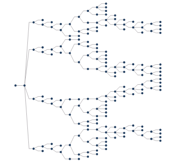

### Instructions

The topological logic diagram is generated based on a network dataset,
representing its logic structure in a visual way.

It can be used for managing resources in kinds of industries like telecom,
traffic, pipeline, electricity, etc. With topological logic diagrams, you can
assess the resource distribution of network resources, predicting and planning
the allocation of follow-up resources.

SuperMap can build topological logic diagrams based on the network
relationships that network segments and nodes express for users to check
network connectivities and acquire logic diagrams of network data. Ar present,
SuperMap supports topological logic diagrams in three structures including
tree diagrams, grade diagrams, and orthogonality diagrams.

* Both tree diagrams and grade diagrams are applicable to directed facility networks that have definite sources. The data as the following figure 1 shows has one source, which means the whole network has only one entrance. Based on the kind of networks, the application can generate tree diagrams and grade digrams as the following figure 2 and figure 3 show.
* To create a tree diagram, a sub network must have only one source or one sink. If there is only one source, the number of sinks isn't required, and vice versa.

 |  | 
---|---|---
Figure 1: The original network dataset | Figure 2: The tree diagram | Figure 3: The grade diagram
* Compared to a tree diagram, the arrangement of a grade diagram is more compact. However, the application will be failed to create tree diagrams if some sub-network has more than one source and one sink as the following figure 4 shows. In this situation, you can create a grade diagram like the following figure 5 shows.

 | 
---|---
Figure 4: The original network dataset | Figure 5: The grade diagram
* To create an orthogonality diagram successfully, SuperMap asked your network data has no loops (the starting point is the ending point). The feature arranges nodes and links of logic diagrams orthogonally according to levels.

### Function Entrances

* **Data** tab > **Topology** > **Topological Logic Diagram** > **Tree Diagram/Grade Graph/Orthogonal Graph**.

### Parameter Description

**Tree Diagram**

* **Layout Direction** : Both tree diagrams and grade diagrams support the directions of layouts of logic diagrams. The supportive directions include from left to right (by default), from right to left, from top to bottom, and from bottom to top. 
* **From Left to Right** : the logic diagram will expand from the left root node.
* **From Right to Left** : the logic diagram will expand from the right root node.
* **From Top to Bottom** : the logic diagram will expand from the top root node.
* **From Bottom to Top** : the logic diagram will expand from the bottom root node.
* **Hierachical Distance** : set the distance between two adjacent levels of the resulting tree diagram. 20 is by default. As the following figure 7 shows, dx is the hierachical distance between two adjacent levels (from node 1 to node 2).
* **Splitting Ratio** : set the ratio that the line will be broken by. 50% is by default. As the following figure 7 shows, the line connecting node 1 and node 2 was broken by 70%.
* **Node Distance** : set the distance between two adjacent nodes. 20 is by default. As the following figure shows, dy is the distance between node 1 and node 2.

**Grade Diagram**

* **Grade Distance** : set the distance between two adjacent levels of the resulting grade diagram. 50 is by default. As the following figure 8 shows, dz is the hierachical distance between two adjacent levels (from node 1 to node 2). 

* **Smoothness** : if you want the application to smooth the resulting diagram, you can specify a smoothness bigger than 1. 1 is by default, which means the application won't smooth the resulting diagram. 

