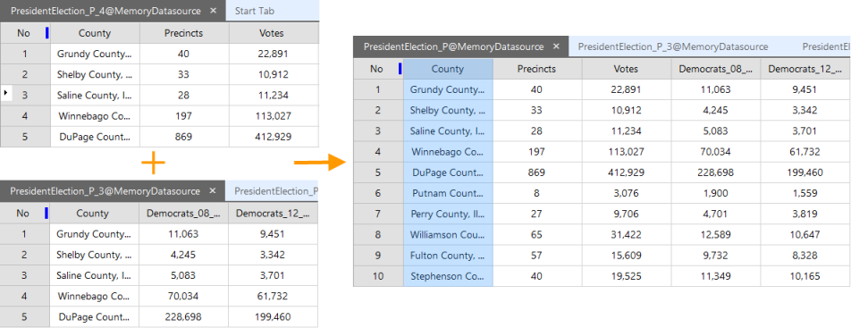

### Introduction

Dataset Append Column is mainly used to add new field to the attribute table of the target dataset. This field value comes form the attribute table of the source dataset.

In the operation, it is needed to set a pair of connection fields, they come form the source dataset and the target dataset respectively, the values can be appended only when there are the same values in the connection fields.

### Function Entrances

* **Data** tab > **Data Processing** > **Vector** > **Append Column**.
* **Toolbox** > **Data Processing** > **Vector** > **Append Columns**. (iDesktopX)

### Parameter Description

* **Target Data** : Select the target dataset to append in the Target Data region and select the join field.
* **Source Data** : Select the source dataset and its join field. The field type of the join field set here should be the same with the join field of the target dataset. 

Make sure that the value of the source data join field is the same with the data value of the join field in the target data, and the corresponding value of the append field can be append to the append field of the target field.

* **Append Field** : Select the fields needed to add to the target dataset in the Append Field region. 

### Note

* The source dataset must contain a field that the target dataset don't have, or the operation will fail.
* The name of the two join fields can be different, but the field type must be the same and they contain the same field value.
* The system will filter out the fields in the source dataset which are also in the target dataset, the system field and SmUserID field, other fields will be listed in the Append Field list box. 
* The field type of the join field can't be binary.
* The user fields must be non-system fields and can't be the SmUserID field.
* For SQLPlus datasource, if the target dataset contains data and has created tile index, it is recommended to delete the tile index and create again for the new dataset after the operation. 

