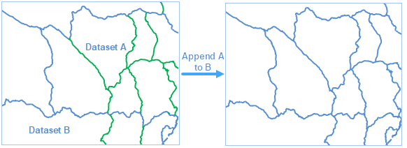

### Introduction

Append data in one or more datasets to another dataset.

Supported datasets include Point/line/region/text/CAD/Model dataset and tabular dataset. The feature doesn't support the network/route dataset.

The field name and field type of the source dataset and the target dataset must be the same.

### Function Entrances

* **Data** tab > **Data Processing** > **Vector** > **Append Row**.
* **Toolbox** > **Data Processing** > **Vector** > **Append Row**. (iDesktopX)
* In the workspace manager, drag one or more datasets to another dataset.

### Parameter Description

* **Target Data** : Specify the target dataset that can be an existing dataset. Or, you can create a new dataset.
* **Source Data** : Select the source dataset in the Source Data list. The datasets in the list box can be edited with the tool bar button. 
* **Create New Fields** : Whether to save other fields of the source data. In the appending process, the exact match fields in the target data will be retained. Create New Fields is used to set whether to retain the fields that exist in the source data but not in the target data. For instance, target dataset NewDataset1 has a field F1, and the source dataset NewDataset2 has a field F2, other field names are all the same. If you choose to save new fields, the result is that the target dataset contains F1 and F2; if you do not select this option, the target dataset will only contain F1. 

### Note

* When the target dataset is a CAD dataset, the source dataset can be a point/line/region/text/CAD dataset; when the target dataset is a tabular dataset, the source dataset can be any kinds of vector datasets; when the target dataset is of other types, the source dataset must belong to the same type. 
* The geometry object in the source dataset will also be appended to the target dataset.
* For SQLPlus datasource, if the target dataset contains data and has created tile index, it is recommended to delete the tile index and create again for the new dataset after the operation.

