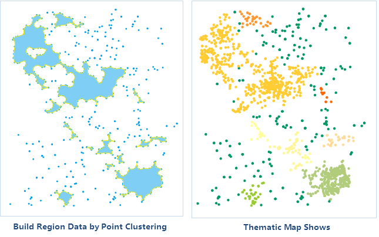

### Introduction

The function of aggregating points can aggregate dense points or construct a polygon for the same cluster of points according to density-based clustering. After aggregation, a field named "ResultType" will be generated for aggregation type information statistics.

### Applications scenarios

This function is applicable to massive data for classification according to the degrees of affinity of spatial relation of points. Also, users can construct region objects for a cluster of points that are dense in the geographical position.

* Remove noisy points of point cloud data: While acquiring point cloud data, it will be affected or disturbed by factors such as human actions, instruments, environment, measurement methods, etc. Therefore, point cloud data acquired will contain some noisy points. Point cloud acquired for measured features is often distributed continuously along the surface and the noisy points are often randomly distributed outside the point cloud. Therefore, users can remove noises through point aggregation function.
* We can construct the area that has weak signals based on monitored data. The communication monitoring system will monitor the strength of the signals. Points with signals weaker than a certain strength will be extracted and areas with weak signals will be constructed through density aggregation function, which can be used for location selection of new signal towers.

### Function Entrances

* **Data** tab > **Data Processing** > **Vector** > **Aggregate Point**.
* **Toolbox** > **Data Processing** > **Vector** > **Aggregate Point**. (iDesktopX)

### Parameter Description

In the **Aggregate Points** dialog box, set the following parameters.

* **Source Data** : Specify the datasource and the point dataset you want.

**Only Aggregate Selected Points** : If you have selected points in the point dataset, you can check the box to aggregate the selected points only.

* **Parameter Settings** : 
* Cluster Radius: Set a radius for point aggregation. You can specify the radius unit from the drop-down list.
* Threshold for number of point: Set and display the least number of points for a cluster. The value should be greater or equal to 2. 
* **Result Data** : specify a datasource to save the result dataset.

After a successful analysis, the output window will have a corresponding prompt. Clustering results obtained are shown below.

### Note

If Aggregate selected points only is checked, only region dataset will be generated, without adding the classification field to the source dataset.

