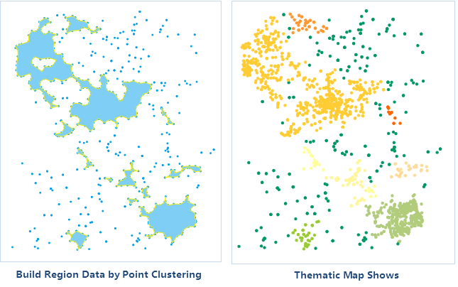

### Introduction

The function of aggregating points can aggregate dense points or construct a polygon for the same cluster of points according to density-based clustering. After aggregation, a field named "ResultType" will be generated for aggregation type information statistics.

### Applications scenarios

This function is applicable to massive data for classification according to the degrees of affinity of spatial relation of points. Also, users can construct region objects for a cluster of points that are dense in the geographical position.

  1. Remove noisy points of point cloud data 

While acquiring point cloud data, it will be affected or disturbed by factors such as human actions, instruments, environment, measurement methods, etc. Therefore, point cloud data acquired will contain some noisy points. Point cloud acquired for measured features is often distributed continuously along the surface and the noisy points are often randomly distributed outside the point cloud. Therefore, users can remove noises through point aggregation function.

  2. We can construct for area that has weak signals based on monitored data. 

The communication monitoring system will monitor the strength of the signals. Points with signals weaker than a certain strength will be extracted and areas with weak signals will be constructed through density aggregation function, which can be used for location selection of new signal towers.

### Basic Steps

  1. In the Data Processing group on the Data tab, click Aggregate points to display the Point Density Aggregation dialog box.
  2. **Source Data**
  * Datasource: The datasource where the point dataset for point aggregation is located.
  * Dataset: The point dataset for point aggregation.
  * **Aggregate selected points only** : If there are selected points in the point dataset, the check box can be checked here to aggregate selected points only. 
  3. Parameter Settings: 
  * Radius: Used to set radius for point aggregation. The unit for radius can be set through the drop-down list.
  * Count Threshold: Used to set and display the least number of points for a cluster. The value should be greater or equal to 2. 
  4. **Result Data**
  * Datasource: Used to set the datasource where the result dataset is located.
  * Dataset: Used to set the saved name of the result region dataset. The points that the anlysist results are the same type will be constructed as a region object.
  5. After setting the above parameters, click OK button to perform the operation. After successful analysis, the output window will have a corresponding prompt. Clustering results obtained are shown below.  
    

### Note

If Aggregate selected points only is checked, only region dataset will be generated, without adding the classification field to the source dataset.