### Introduction

Update the attribute of the objects in the dataset with the spatial relationship.

Dataset Attributes Update functionality provides two operation methods to update target data, the first is select the dataset and update by conditions; the second is select the geometry object to update in the map window, then check "Update Selected Only" (only the geometry object in one dataset will be updated).

### Function Entrances

* **Data** tab > **Data Processing** > **Vector** > **Dataset Attributes Update**.
* **Toolbox** > **Data Processing** > **Vector** > **Dataset Attributes Update**. (iDesktopX)

### Parameter Description

* **Data with attributes offered** : specify a dataset whose attribute information will be used to update target data.
* **Target Data** : specify the dataset to be updated. 
* Save Statistic Info: Count the number of geometry objects with the given spatial relationship in the source dataset and the target dataset, and save it to a integer field in the target dataset. 

Check **Save Statistic Info** and select a field to save the count of the updated objects (it is recommended to create a new field to store the information to avoid damaging the original data).

* Filter: Click the button on the right of filter label, set the field filter criteria in the displayed [SQL Expression](../../Query/SQLDia) dialog box. When an attribute is updated, the object that matches the expression condition in the target dataset is filtered, and the field information in the source dataset is not updated to these object properties.
* Select the geometry object to update in the map window, check **Update Selected Objects Only**. (Only operate some geometry objects in a dataset.)
* **Spatial Relation** : the spatial relation of the geometry object in the target dataset relative to the objects in the source dataset. There are three relations "Contain", "Within" and "Intersect". 

In the figure below, the target data objects are shown in green, the source data objects that meet the spatial relations are shown in red, the source data objects that do not meet the spatial relations are shown in black.

* **Contain** : The geometry object in the target dataset contains the geometry object in the source dataset.

Classes | Target point | Target line | Target region
---|---|---|---
**Source point** | 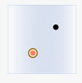 | 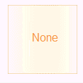 | 
**Source line** |  | 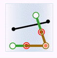 | 
**Source region** | 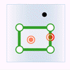 | 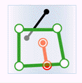 | 

* **Within** : The geometry object in the target dataset is within the geometry object in the source dataset.

Classes | Target point | Target line | Target region
---|---|---|---
**Source point** |  |  | 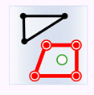
**Source line** |  | 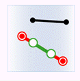 | 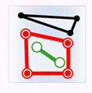
**Source region** |  |  | 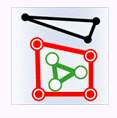

* **Intersect** : The geometry object in the target dataset intersects with the geometry object in the source dataset.

Classes | Target point | Target line | Target region
---|---|---|---
**Source point** |  | 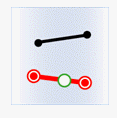 | 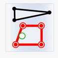
**Source line** |  | 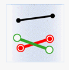 | 
**Source region** | 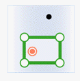 | 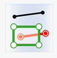 | 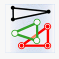

* **Boundary Outside Region** : Set whether the border of region object is inside the region. 
* This check box will be active only when determining the contain relationship of a region dataset and a point dataset or the intersection relationship of a region dataset or a line dataset.
* **Contain Border** means a point on a border of a region is considered inside the region. If a line intersects with a border of a region, the line also intersects with the region. 
* **Not Contain Border** means that a point on a border of a region will not be considered inside the region. Similarly, if a line intersects with a border of a region and other part doesn't fall in the region, the line won't be considered intersecting with the region.
* **Get Value** : if there are several objects meetting the conditions and can provide the attribute data, the source object will be processed with certain "Get Value" method before assigned to the target object. 
* Assign value: Get one of the attribute data randomly. Used for assign value one to one.
* Mean: Get the average value to update. Used for numeric fields. 
* Sum: Get the sum of the attributes to update. Used for numeric fields.
* Max: Get the maximum value from the attributes to update. Used for numeric fields. 
* Min: Get the minimum value from the attributes to update. Used for numeric fields. 
* Max SMID: Get the attribute value with the maximum SMID for update.
* Min SMID: Get the attribute value with the minimum SMID for update. 
* In the "Field Settings" area, check the source field to be updated, and then click the Target Field item to save the updated result.

**Note** : Fields shown on the list are filtered out according to the type of field, so if there is no field shown on the list, you can create a new one.

* The "Ignore system field" check box is used for setting whether to ignore the system fields. Checking it means Yes, on the contrary, No.
* After the update, the fields in the target dataset attribute table (new or existing fields) will update the corresponding field value in the source dataset.

### Note

* When setting fields, it is required that the source field and the target field must be the same type. 
* Different statistic methods uses different statistic fields. Assign value, Max SMID and Min SMID support numeric or text type, but do not support boolean, notes and date. Max, Min, Average and Sum support numeric fields.

