### Introduction

Update the attribute of the objects in the dataset with the spatial relationship.

Dataset Attributes Update functionality provides two operation methods to update target data, the first is select the dataset and update by conditions; the second is select the geometry object to update in the map window, then check "Update Selected Only" (only the geometry object in one dataset will be updated).

### Basic Steps

  1. In the Data tab, click "Update Attributes" button in the Vector group, the Update Attributes dialog box appears.  
  2. Select the dataset to update in the Target Data region, users can update the selected dataset, or update some geometry objects in the dataset.
    * Select datasource and dataset, set other parameters to update the attributes of this dataset.
  3. In the area of "Target Data", set the dateset and the datasource where the dataset is located in. 
  4. Save Statistics: Count the number of geometry objects with the given spatial relationship in the source dataset and the target dataset, and save it to a integer field in the target dataset. 

Check "Save Statistics" and select a field to save the count of the updated objects (it is recommended to create a new field to store the information to avoid damaging the original data).

  5. Filter: Click the button on the right of filter label, set the field filter criteria in the displayed [SQL Expression](../../Query/SQLDia.htm) dialog box. When an attribute is updated, the object that matches the expression condition in the target dataset is filtered, and the field information in the source dataset is not updated to these object properties.
  6. Select the geometry object to update in the map window, check "Update Selected Only". (Only operate some geometry objects in a dataset.)
  7. Set "Spatial Relation", the spatial relation of the geometry object in the target dataset relative to the objects in the source dataset, there are three relations "Contain", "Within" and "Intersect". 

"Spatial Relation" Explain

In the figure below, the target data objects are shown in green, the source data objects that meet the spatial relations are shown in red, the source data objects that do not meet the spatial relations are shown in black.

* Contain: The geometry object in the target dataset contains the geometry object in the source dataset.  

Classes | Target point | Target line | Target region  
---|---|---|---  
**Source point** | 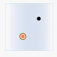 |  |   
**Source line** | 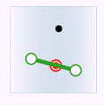 | 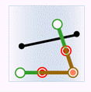 |   
**Source region** |  | 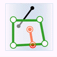 | 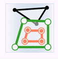  

* Within: The geometry object in the target dataset is within the geometry object in the source dataset.  

Classes | Target point | Target line | Target region  
---|---|---|---  
**Source point** |  | 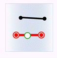 | 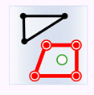  
**Source line** |  |  | 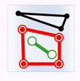  
**Source region** |  |  | 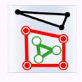  
    
* Intersect: The geometry object in the target dataset intersects with the geometry object in the source dataset.  

Classes | Target point | Target line | Target region  
---|---|---|---  
**Source point** |  |  | 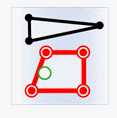  
**Source line** | 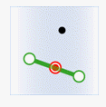 |  | 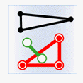  
**Source region** | 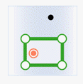 | 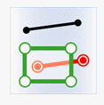 | 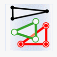  
  
  8. The "Boundary Outside Region" is not checked by default. It is used in the determine of the spatial relationship, which is used to set whether the border of region object is inside the region. 
  * This check box will be activated only when determine the contain or intersection relationship of the region or line.
  * By default the following boundary will be calculated as inside the region, that is the points on the border of the region are also considered as the points inside the region.
  * If "Boundary Outside Region" is checked, the points on the boundary of the region will not be considered as the points inside the region. If the points on a line coincide with the points on the border of the region, the line are not intersect with the region.
  9. Set "Get Value", if there are several objects that meet the conditions and can provide the attribute data, the source object will be processed with certain "Get Value" method before assigned to the target object. 
  * Assign value: Get one of the attribute data randomly. Used for assign value one to one.
  * Mean: Get the average value to update. Used for numeric fields. 
  * Sum: Get the sum of the attributes to update. Used for numeric fields.
  * Max: Get the maximum value from the attributes to update. Used for numeric fields. 
  * Min: Get the minimum value from the attributes to update. Used for numeric fields. 
  * Max SMID: Get the attribute value with the maximum SMID for update.
  * Min SMID: Get the attribute value with the minimum SMID for update. 
  10. In the "Field Settings" area, check the source field to be updated, and then click the Target Field item to save the updated result.

**Note** : Fields shown on the list are filtered out according to the type of
field, so if there is no field shown on the list, you can create a new one.

  11. The "Ignore system field" check box is used for setting whether to ignore the system fields. Checking it means Yes, on the contrary, No.
  12. After the update, the fields in the target dataset attribute table (new or existing fields) will update the corresponding field value in the source dataset.

### Note

  1. When setting fields, it is required that the source field and the target field must be the same type. 
  2. Different statistic methods uses different statistic fields. Assign value, Max SMID and Min SMID support numeric or text type, but do not support boolean, notes and date. Max, Min, Average and Sum support numeric fields.