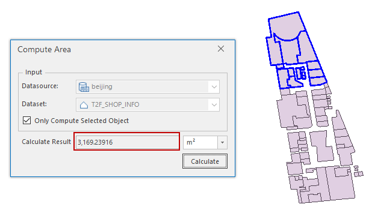

###  Instructions

Calculates the area of one or more polygons. Dozens of area units are provided for you to chooser including: square kilometer (km2), square meter (m2), hectare, are, qing, mu, square foot, acre and so on.

### Function Entrances

* **Data** tab > **Data Processing** > **Vector** > **Compute Area**.
* **Toolbox** > **Data Processing** > **Vector** > **Compute Area**. (iDesktopX)

### Parameter Specification

In the **Compute Area** dialog box, set the following parameters.

* **Source Data** : Specify the source datasource and the region dataset for the calculation.
* **Only Compute Selected Object** : You can open the dataset you specified at the Dataset text box, and then select the polygons for the calculation. The check box is available only when there is at least one polygon selected. If you do not choose any polygon, the area of whole dataset will be calculated.
* **Area units** : The default is "square meter (m2)". You can click the drop-down list to specify another unit.
* **Calculate** : Click the button to perform the calculation, and the result will be shown on the "Calculate Result" text and output in the Output Window at the same time.  

  

###  Note

The **Compute Area** dialog box is non-modal, and so you can open your dataset and select objects after opening the dialog box.

