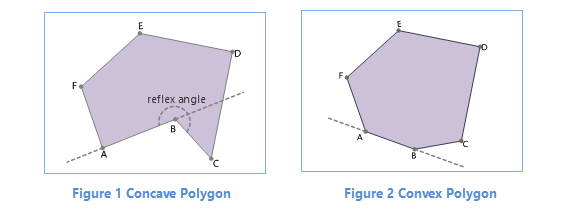
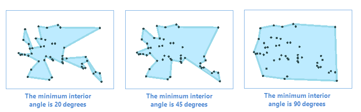
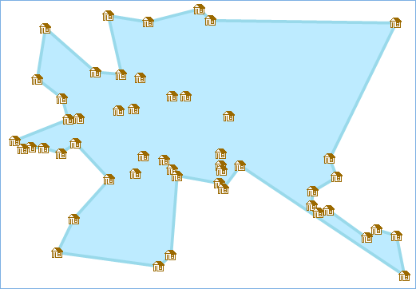

---
id: CalculateConcaveHull
title: Calculate a concave polygon
---
###  Instructions

A concave polygon is a simple polygon that always has at least one reflex interior angle (that is the angle with a measure that is between 180 degrees and 360 degrees). As the following figure 1 shows, ∠ABC is a reflex angle, and not all of other edges of the polygon are located in the same side of the extension of line AB. Another kind of polygons is the convex polygon. In a convex polygon, all other edges will be fallen into the same side of the extension of an edge. All interior angles of a convex polygon are less than or equal 180 degrees.

* Generally use a concave polygon to represent the point coverage in a certain area. The reason of using a concave polygon but a convex polygon is that a convex polygon will contain more blank areas than a concave polygon.
  

* supports specifying a point set or a point dataset and the minimum interior angle to calculate a concave polygon. The minimum angle have an effect to the area of the result polygon. In general, the smaller the angle, the smaller the area. Not the angle of setting is as small as possible, you need to set it reasonably.
  

### Function Entrances

* **Data** tab > **Data Processing** > **Vector** > **Compute Concave Polygon**.
* **Toolbox** > **Data Processing** > **Vector** > **Compute Concave Polygon**. (iDesktopX)

###  Parameter Specification

* **Source Data** : Specify the point dataset you want.
* **Only Compute Selected Object** : Only calculate a concave polygon for the selected points. The check-box is available only when there is at least one point selected, otherwise, a concave polygon including all points will be calculated out.
* **Rotation** : The minimum interior angle in the result concave polygon which should be a value between 0 to 180 degrees (0 and 180 degrees are exclusive). The default is 45 degrees.
* **Result Data** : Specify a datasource and a dataset which can be new or existing to save the result polygon. 
* Click **OK** to perform the operation, and the result data will be opened directly.

**Instance** : A logistics company can use all dispatching points to calculate a concave polygon thereby to divide the delivery area according to all positions where packets will be dispatched to. Set the minimum angle is 45 degrees, and the result is as follows:

  
