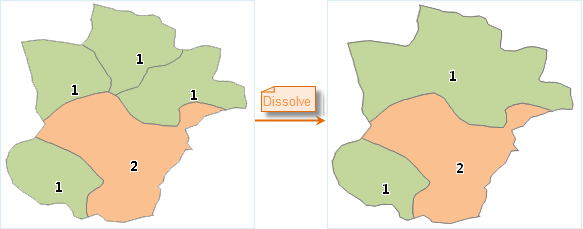
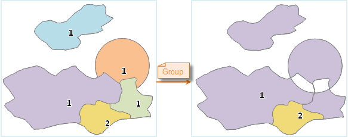

### Introduction

In a line, region or text dataset, the feature can dissolve objects meeting
some conditions to one object.

The following conditions are needed for dataset dissolving:

  * The values of certain fields are the same in the data object.
  * Only the line objects with the same endpoints can be dissolved. 
  * The region objects must be intersects or adjacent with each other (have common borders).

The Dissolve feature includes three process methods: Dissolve, Group and Group after Dissolve. **Note** , to a text dataset, only Group is supported.

  * The effect of dissolve:

  

Figure: Dissolve the object with the index 1  
  
The result above shows that the region with the index 1 is dissolved, but not
the objects that are not adjacent with each other.

  * The effect of group: 

  
Figure: The object with the index 1 is grouped to a compound object.  
  
The result above shows grouping several subobjects to a composite object, the intersection part of the object is processed with the XOR computing.

### Basic Steps

  1. In the Data tab, click "Dissolve" button in the Data Processing group, the Dissolve Dataset dialog box appears.  
  2. **Source Data** : Displays all the line and region datasets under the selected datasource. Select the datasets to dissolve.
  3. **Parameter Settings**

  * Mode: Three dissolve modes are provided. 
    * Dissolve: Dissolve the objects which have the same attribute fields and intersects with each other (or the distance between them are within the tolerance) to one object.
    * Group: Group the objects with the same attribute fields to one object, at the same time deleting the overlap parts.
    * Group after dissolving: Dissolve the objects with the same attribute fields and intersect/tangent with each other to one object, if the dissolving fields are the same after dissolving, group it to a complex object.
  * **Dissolve Tolerance** : If the distance between two or more nodes are in the tolerance, the nodes will be merged to one node. The default value is one millionth of the dataset border (the maximum tolerance is 100 times of the default tolerance), the unit is the original unit of the dataset.

**Note** : For a text dataset, the disolve mode only can be Union. Setting a
tolerance is meaningless.

  * **Filter** : Only the objects meet this condition will be used in the calculation.
  * **Process objects with null field values** : If this check box is checked, the objects with the dissolving filed as null will be used in the dissolving operation.
  4. **Result Data** : Rename and save the dissolve result dataset and select the datasource that contains it.
  5. **Field** : The fields that have the same value in the dataset. Dissolve or group the dataset value according to this field value.
  6. **Statistical Field** : Select the statistic method and create new field save value, the statistic method can be Max, Min, Sum, Average, First Object and Last Object.
  * Max: The maximum value of the dissolve/group object, only support numeric and time fields.
  * Min: The minimum value of the dissolve/group object, only support numeric and time fields.
  * Sum: The sum value of the dissolve/group object, only support numeric fields.
  * Average: The average value of the dissolve/group object, only support numeric fields.
  * First Object: The field value of the object with the minimum SmID in the dissolve/group objects.
  * Last Object: The field value of the object with the maximum SmID in the dissolve/group objects.
  7. Click "OK" to perform the operation. 

### Note

  * When the values of the dissolve field are the same, if there are three or more line with end point coincide as one point, the system will not perform the dissolving operation. 