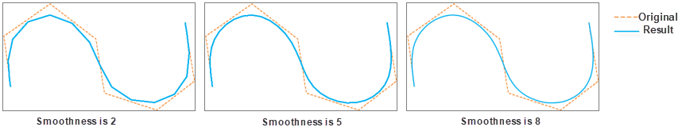

### Introduction

Smooths lines and borders of polygons.

### Function Entrances

* **Data** tab > **Data Processing** > **Vector** > **Smooth Line and Region**.
* **Toolbox** > **Data Processing** > **Vector** > **Smooth Line and Region**. (iDesktopX)

### Parameter Specification

Specify the dataset you want to smooth.

  * Click on the **Add** icon to open the **Select** dialog box where you can select the datasets you want to smooth.
  * Smoothness: The count of node to interpolate in the smoothing operation, it is an integer larger than or equal to 2. The location of the node to insert is identified with the B Spline. The more interpolation points, the smoother the polyline after process. The recommended value range is [2,10].

To know more about the smooth process, please refer to the [Smooth Method Introduction](SmoothMeth).

  

