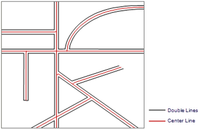

### Introduction

This function is to generate center lines from unclosed double lines and save them as a line dataset. This function is usually used to get center lines for streets comprised of two lines. The function works better for parallel lines.

### Basic Steps

  1. In the workspace, open your target datasource.
  2. In the Data Processing group of the Data tab, click the Center Line of Double Lines button, and select Extract Center Line from Double Lines. 
  3. In the section of Source Data, specify the datasource and dataset.
  4. In the section of Target Data, specify the result datasource and dataset name. 
  5. In the section of Parameter Settings, specify the max and min distance between the double lines.

  * Max Width: the maximum distance between the double line. The unit of this parameter is the same with the source dataset. To determine the max distance, you can use the Measure tool to manually measure the widest part of the double line. It is advised that you set the max width parameter a bit larger than the measured value. 
  * Min Width: the minimum distance between the double line. If the distance between double lines is less than the min width, then no center line will be extracted for that part of the double line. The unit of this parameter is the same with the source dataset. 

Note that: The unit of maximum and minimax width should be the same with source dataset. The maximum width should be larger than 0. Center lines will only be extracted from double lines with distances between Max and Min Width. If the distance between double lines is larger than the max width, the border line will be extracted.

  6. Click OK to complete. The center line dataset attribute will retain the attributes of the source double data, and the field name will distinguish the two sides line objects through the L and R.  
    

### Note

  * This function is only applicable to unclosed double lines. If the lines are closed, you need to split the double line at certain points.
  * The value of the max width is important. You need to set an accurate value.
  * The extraction may not be satisfying when there are intersecting doubleline streets.