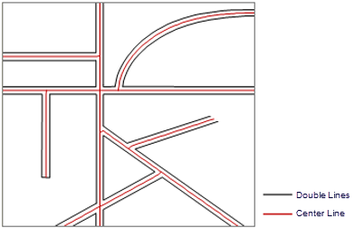

### Introduction

Generates center lines from unclosed double lines and save them as a line
dataset. This function is usually used to get center lines for streets
comprised of two lines. The function works better for parallel lines.

### Function Entrances

* **Data** tab > **Data Processing** > **Vector** > **Extract Center Line from Double Lines**.
* **Toolbox** > **Data Processing** > **Vector** > **Extract Center Line from Double Lines**. (iDesktopX)

### Parameter Specification

In the **Extract Center Line from Double Line** dialog box, set the following parameters:

* In the **Source Data** area, specify the required line dataset.
* In the **Target Data** area, specify the result datasource to save the result dataset. The name of the result dataset is CenterLineResult by default. You are allowed to modify the name. 
* In the **Parameter Settings** area, specify the max and min distances between double lines.

  * **Max Width** : the maximum distance between the double line. The unit of this parameter is the same with the source dataset. To determine the max distance, you can use the Measure tool to manually measure the widest part of the double line. It is advised that you set the max width parameter a bit larger than the measured value. 
  * **Min Width** : the minimum distance between the double line. If the distance between double lines is less than the min width, then no center line will be extracted for that part of the double line. The unit of this parameter is the same with the source dataset. 

**Note** : The unit of maximum and minimax widths should be the same as the
source dataset. The maximum width should be larger than 0. Center lines will
only be extracted from double lines with distances between Max and Min Width.
If the distance between double lines is larger than the max width, the border
line will be extracted.

* Click **OK** to perform the operation. The center line dataset attribute will retain the attributes of the source double data. The field name will distinguish the line objects of two sides through the L and R.  

  
  
### Note

* This function is only applicable to unclosed double lines. If the lines are closed, you need to split the double line at certain points.
* The value of the max width is important. You need to set an accurate value.
* The extraction may not be satisfying when there are intersecting double-line streets.
  
