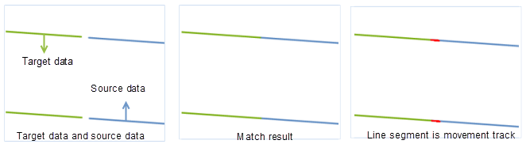

### Introduction

This function is used to match and connect line segments from two datasets that are expected to be continuous.

This function is applicable to 2D line datasets. The matching modes include: Other Edge, Middle Point, and Intersection.

### Basic Steps

  1. In Data Processing group of Data tab, click Edge Match button in Data Processing Gallery, and the following dialog box pops up. 
  2. Source Data: 

Specify the dataset and datasource. The coordinate system of source dataset
must be consistent with the coordinate system of target dataset.

  3. Target Data 

Specify the target dataset and datasource. Note that the Edge Match function
will modify the source dataset. So you need to back up your data in advance if
you want to keep a copy of the original dataset.

  4. Parameter Settings 

Mode:  supports three types of matching for the source and target dataset as
explained below:

  * Other Edge: in this mode, the matching edge lines in the source and target dataset will match and connect to each other at their nodes.
  * Middle Point: in this mode, the matching edge lines in the source and target dataset will extend and connect to each other at the middle location of their nodes.
  * Intersection: in this mode, the matching edge lines in the source and target dataset will connect to each other at the their intersection.

Lines: if the match mode is set to "Intersection", this option is activated. You can check it and select/draw a line to determine the intersection.

Tolerance: Set the tolerance. if the distance between the nodes of the two matching edge lines are within this tolerance value, then they will connect with each other. The unit of tolerance is the same with that of the dataset.

Edge match union: check this option to dissolve the two matched edge lines into one. And the other objects from the source dataset will also be appended to the target dataset.

Attribute Kept: Specify the resulting matched edges' attributes.

  * **Not Null Attribute** : assigns the corresponding not-null attribute values (which can be from both the source dataset and the target dataset) to the resulting matched lines. If both the source line and the matched target line have attribute values, assigns the former's attribute value to the resulting line. 
  * **Source Field Attributes** : Assigns the attribute values of the source lines to the corresponding resulting lines.
  * **Target Field Attributes** : Assigns the attribute values of the target lines to the corresponding resulting lines.

  5. Edge match link data: check this option and the auxiliary lines in the operation will be saved as a line dataset. The auxiliary lines are the traces for the connecting operation. You can set the name for this auxiliary line dataset.
  6. Click OK to complete the operation. Below shows the result of this function performed on the sample data:

  
Figure: Sample Result (Mode: Other Edge)  

### Note

  1. The two datasets must have the same coordinate system.
  2. When the matching mode is set to "Intersection", if neither the matched edge lines have any intersection actually nor that you select/draw a geoline, the application will use the "Other edge" mode to connect.