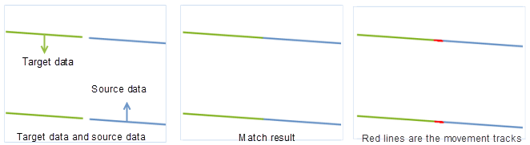

### Introduction

This function is used to match and connect line segments from two datasets that are expected to be continuous.

This function is applicable to 2D line datasets. The matching modes include: Other Edge, Middle Point, and Intersection.

### Function Entrances

* **Data** tab > **Data Processing** > **Vector** > **Edge Match**.
* **Toolbox** > **Data Processing** > **Vector** > **Edge Match**. (iDesktopX)

### Parameter Specification

* **Source Data** : Specify the source dataset. The coordinate system of source dataset must be consistent with the target dataset.

* **Target Data** : 

Specify the target dataset and datasource. Note that the Edge Match function
will modify the source dataset. So you need to back up your data in advance if
you want to keep a copy of the original dataset.

* Parameter Settings 
  * **Mode** :  supports three modes as explained below:
    * **Other Edge** : in this mode, the matching edge lines in the source and target dataset will match and connect to each other at their nodes.
    * **Middle Point** : in this mode, the matching edge lines in the source and target dataset will extend and connect to each other at the middle location of their nodes.
    * **Intersection** : in this mode, the matching edge lines in the source and target dataset will connect to each other at the their intersection.
  * **Lines** : if the match mode is set to "Intersection", this option is activated. You can check it and select/draw a line to determine the intersection.
  * **Tolerance** : Set the tolerance. if the distance between the nodes of the two matching edge lines are within this tolerance value, then they will connect with each other. The unit of tolerance is the same with that of the dataset.
  * **Edge Match Union** : check this option to dissolve two matched edge lines. The other objects from the source dataset will also be appended to the target dataset.
  * **Save Attribute** : Specify which attributes you want to save. 
    * **Not Null Attribute** : assigns the corresponding not-null attribute values (which can be from both the source dataset and the target dataset) to the resulting matched lines. If both the source line and the matched target line have attribute values, assigns the former's attribute value to the resulting line. 
    * **Source Attributes** : Assigns the attribute values of the source lines to the corresponding resulting lines.
    * **Target Field Attributes** : Assigns the attribute values of the target lines to the corresponding resulting lines.
* **Save Edge Matched Data** : check this option to save the auxiliary lines in the operation as a line dataset. The auxiliary lines are the traces for the connecting operation. You can specify the name of this auxiliary line dataset.
* After all settings, you can perform the operation. The following pictures demonstrate how the feature works on the sample data:
  
  
### Note

* The two datasets must have the same coordinate system.
* When the matching mode is set to "Intersection", if neither the matched edge lines have any intersection actually nor that you select/draw a geo-line, the application will use the "Other edge" mode to connect.

