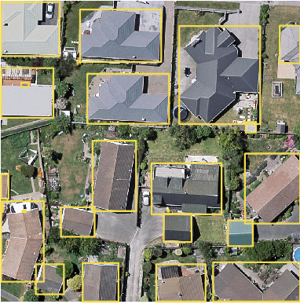

### Function Introduction

Creates envelope rectangles for lines or polygons resulting in a region dataset. Assigns attributes of original objects to the new objects.

 |   
---|---  
Envelope rectangles of lines | Envelope rectangles of polygons  
  
### Application acenarios

In AI remote sensing image information extraction, the feature can provide envelope rectangles of targets of interest convenient for extracting information like buildings, cultivated land, and so on.

### Function entrances

Click on Data > Data Processing > Object Envelope Surface.

### Parameter Description

  * **Source Data** : Select the dataset to be analyzed which can be either a line dataset or a region dataset.
  * **Split Subobject** : This feature focuses on complex lines or polygons. 
    * Checking the checkbox splits complex objects into simple objects. iDesktop will generate envelope rectangles for each simple object.
    * If you don't check it, every complex object will be taken as one object. iDesktop will generate envelope for each complex object.
  * **Result Data** : The resulting data will be a region dataset. Attributes of original data will be assigned to the corresponding polygons.

### Sample Applications

The envelope rectangle of each interest target is used as the label of each target when training data for target detection. Hence, we can use the feature Object Envelope Surface to prepare label data for target detection.

 |   
---|---  
Targets' vector borders | Resulting envelope rectangles of objects  