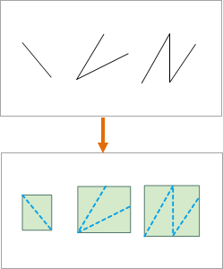
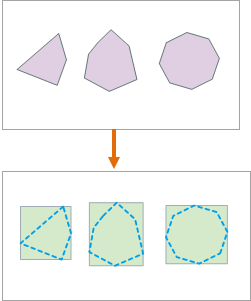
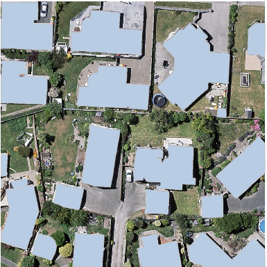
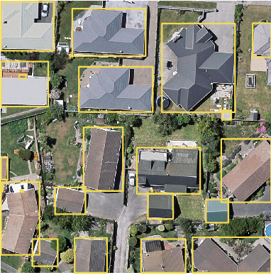

### Function Introduction

Creates bounding rectangles of lines or polygons resulting in a region dataset and assigns attributes of original objects to the new objects.

 
  

  
### Application acenarios

In AI remote sensing image information extraction, the feature can provide
envelope rectangles of targets of interest convenient for extracting
information like buildings, cultivated land, and so on.

### Function entrances

* **Data** tab > **Data Processing** > **Vector** > **Bounding Rectangle**.
* **Toolbox** > **Data Processing** > **Vector** > **Bounding Rectangle** (iDesktopX)

### Parameter Specification

* **Source Data** : Select the dataset to be analyzed which can be either a line dataset or a region dataset.
* **Split Subobject** : This feature focuses on complex lines or polygons. 
  * Check the checkbox to split complex objects into simple objects. iDesktop will generate envelope rectangles for each simple object.
  * If you don't check it, iDesktop will generate an envelope for each complex object.
* **Result Data** : The resulting data will be a region dataset. Attributes of original data will be assigned to the corresponding polygons.

### Sample Applications

The envelope rectangle of each interest target is used as the label of each
target when training data for target detection. Hence, we can use the feature
Object Envelope Surface to prepare label data for target detection.

   