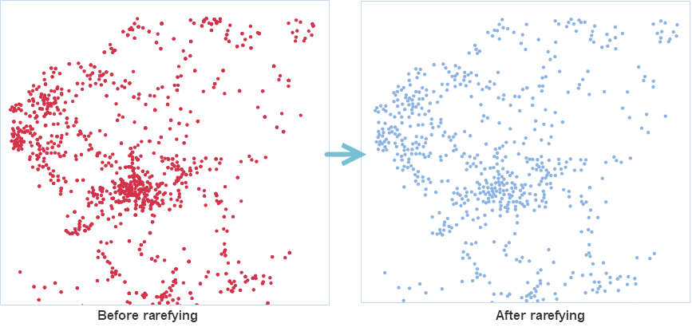

### Introduction

Specify a rarefying radius first. Then the application will keep one point
only in each rarefying circle whose center is each point object. The resulting
points are obtained randomly.

### Application scenarios:

* This function applies to improve the performance and quality of maps if it has a lot of points that overlap with each other in a small scale.

### Basic Steps

* **Data** tab > **Data Processing** > **Vector** > **Rarefy Points**.
* **Toolbox** > **Data Processing** > **Vector** > **Rarefy Points** (iDesktopX)

### Parameter Specification

In the **Rarefy Points** dialog box set the following parameters:

* **Source Data**
  * Source Data: Specify the point dataset that you want to rarefy.
  * Only Rarefy Selected Points: check this box to rarefy the selected points only. The application won't save unselected points in the result dataset.
* **Parameter Settings**
  * **Rarefying Radius** : set the radius of the rarefied point. It indicates that only one point is randomly placed within the radius circle, and the larger the radius, the more sparse the point object in the result dataset.
  * **Statistics Type** : Select a statistics type to recalculate original field values of retained points within the rare radius, and the results will be assigned to a new statistics field which is added to the result dataset. The supported statistics types include: 
    * Mean: The value of statistics field is the average value of attribute values of all points within the range of radius.
    * Max: The value of statistics field is the maximum value in attribute values of all points within the range of radius.
    * Min: The value of statistics field is the minimum value in attribute values of all points within the range of radius.
    * Sample Standard Deviation: The value of statistics field is the sample standard deviation of attribute values of all points within the range of radius.
    * Sample Variance: The value of statistics field is the sample standard deviation of attribute values of all points within the range of radius.
    * Standard Deviation: The value of statistics field is the standard deviation of attribute values of all points within the range of radius.
    * Variance: The value of statistics field is the variance of attribute values of all points within the range of radius.
    * Sum: The value of statistics field is the sum of attribute values of all points within the range of radius.
  * **Randomly Save Rare Points** : Randomly save a point within the range of radius when checking "Randomly Save Rare Points". Otherwise, save the point with least total distance from the point to other points within the radius range. 
* **Result Data** : Set a datasource to save the resulting dataset.
* The integer attribute fields of your point dataset will be shown in the right of the **Rarefy Points** dialog box. You can specify which fields to participate in the operation and Statistics Field and Statistics Type. 
* After finishing the above parameter settings, click the **OK** button. After completing the operation successfully, the output window will output the compression rate of points. The following pictures show how the feature works. The left picture shows the original points. After rarefying the points, we found the points in the right picture having no overlaps and sparse.
  

