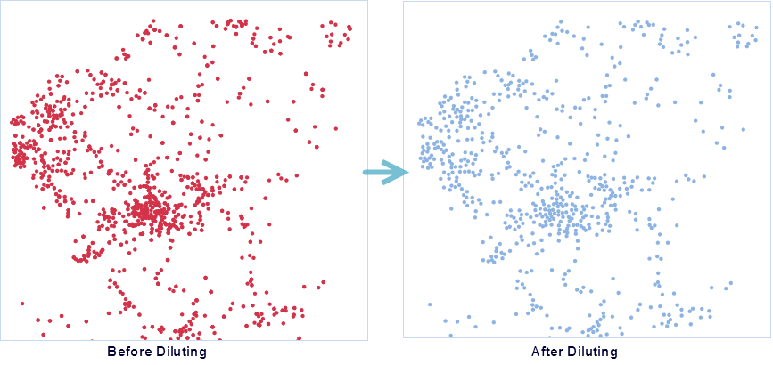

### Introduction

This function refers to that according to the specified radius, to a point in
the dataset as the center dilute all the points in the circle. And then
randomly use a point to represent all the points, the point after the diluting
is not necessarily the center points.

### Application scenarios:

  * This function can be used to improve the performance and quality of maps if it has a lot of points that conflict with each other at a small scale.

### Basic Steps

  1. In the Data Processing group of the Data tab, click the Rarefy Points button. In the dialog box, you need to set a number of parameters:
  2. **Source Data**
  * Datasource: Specify the datasource the point dataset is in.
  * Dataset: Specify the dataset whose points you want to rarefy.
  * Rarefy the selected points only: if you only want to perform the operation on the points you select, you can check this option. And the unselected points will not be saved in the result dataset.
  3. **Parameter settings**
  * **Radius** : Used to set the radius of the rarefied point, it indicates that only one point is randomly placed within the radius circle, and the larger the radius, the more sparse the point object in the result dataset.
  * **Statistics Type** : Select a statistics type to recalculate original field values of retained points within the rare radius, and the results will be assigned to a new statistics field which is added to the result dataset. The supported statistics types include: 
    * Mean: The value of statistics field is the average value of attribute values of all points within the range of radius.
    * Max: The value of statistics field is the maximum value in attribute values of all points within the range of radius.
    * Min: The value of statistics field is the minimum value in attribute values of all points within the range of radius.
    * Sample Standard Deviation: The value of statistics field is the sample standard deviation of attribute values of all points within the range of radius.
    * Sample variance: The value of statistics field is the sample standard deviation of attribute values of all points within the range of radius.
    * Standard Deviation: The value of statistics field is the standard deviation of attribute values of all points within the range of radius.
    * Variance: The value of statistics field is the variance of attribute values of all points within the range of radius.
    * Sum: The value of statistics field is the sum of attribute values of all points within the range of radius.
  * **Randomly Save Rare Points** : Randomly save a point within the range of radius when checking "Randomly Save Rare Points". Otherwise, save the point with least total distance from the point to other points within the radius range. 
  4. **Result Data**
  * Datasource: Set the datasource to save the dataset.
  * Dataset: Specify the result dataset name. 
  5. The attribute fields whose data type is integer in your point dataset you want to do the "Rarefy Points" function will be shown in the right of "Rarefy Points" dialog box. You can select fields participating in the rarefying operation and set Statistics Name and Statistics Type. 
  6. After setting the above parameters, click the "OK" button to dilute the specified point data set. After successful execution, the output window will have a corresponding prompt.
  