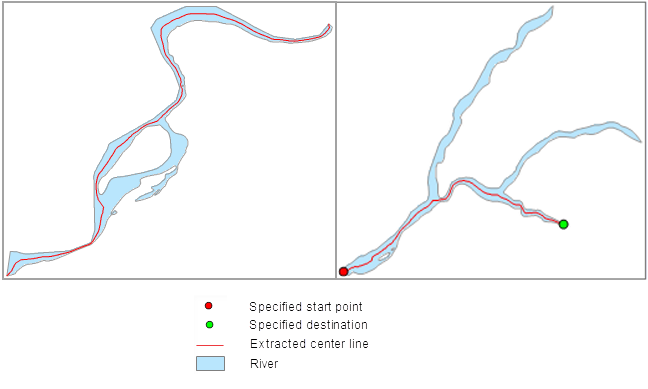

### Introduction

Extracts the center line of the main street from the region dataset. The
extraction will follow the longest length of the region object and save it in
a line dataset. This function is often used to get the centerline of the main
river.

By default, the extraction will follow the longest length of the region
object; meanwhile, it is also supported to extract the center line from a
selected region objects. If the extent of the result center line is not
satisfying, you can also specify the start and end node. If the region object
has island features in it, the extraction will following a shortest route.

### Function Entrances

* **Data** tab > **Data Processing** > **Vector** > **Main Center Line of Region**.
* **Toolbox** > **Data Processing** > **Vector** > **Main Center Line of Region** (iDesktopX)

### Basic Steps

The feature can extract the center lines of either selected regions or all
regions of a region dataset.

* In the section of Source Data, specify the datasource and dataset.

If you don't check the option **Select Regions** , the application will
extract the center lines of all regions. You can re-specify a region dataset.

If you check the option **Select Regions** , the application will extract the
center lines of the selected regions will be extracted. You are not allowed to
re-specify a region dataset.

* In the section of Result Data, you can set a datasource to save the result dataset. If you check **Show in Map** , the extraction result will be displayed on map.
* In the **Selected Region Setting** area, you can check the option **Designate start and end points** and click the Select button to select the starting and end points from the dataset, also you can input their x, y coordinate value in the textbox. Note that the extract may not start exactly from the specified starting point, but from a point near it. 

Note that, only when the user checks the option "Extract selected region
only", you can extract center line from the specified start and end point.

* Click OK to complete the parameter settings and perform the operation.
  
 
  
### Note

* If the start and end points are the same point, then it means no valid start and end points are specified, and the extraction will follow the longest centerline for the region object.
* If the start and end points are out of the region object, then it will prompt error in the output box.
* The extraction will follow the longest length of the region object. If the extent of the result center line is not satisfying, you can also specify the start and end node.

