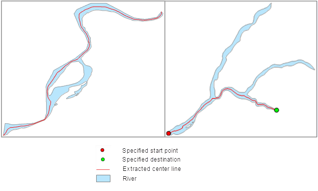

### Introduction

This function is used to extract the center line of the main street from the region dataset. The extraction will follow the longest length of the region object and save it in a line dataset. This function is often used to get the centerline of the main river.

By default, the extraction will follow the longest length of the region object; meanwhile, it is also supported to extract the center line from a selected region objects. If the extent of the result center line is not satisfying, you can also specify the start and end node. If the region object has island features in it, the extraction will following a shortest route.

### Basic Steps

Before you extract the center line, you can select any region object or unselect any region by extracting from all features in the region dataset.

**Extract for Selected Region**

  1. Open a region dataset and select a region feature.
  2. In the Data Processing group of the Data tab, click the Main Center Line of Region button, and pop up the dialog box.
  3. In the section of Source Data, specify the datasource and dataset.

If you don't check the option of "Extract selected regions only", then the center lines of all the regions will be extracted. You can respecify the region dataset and datasource.

If you check the option of "Extract selected regions only", then only the center lines of the selected regions will be extracted. When this option is checked, you cannot respecify the region dataset and datasource.

  4. In the section of Result Data, you can set the datasource and dataset to save the result data. If you check "Display in Map", then the extraction result will be displayed on map.
  5. In the section of Settings, you can check the option of "Specify start and end points", click the  button to select the starting and end point from the dataset, also you can input their x, y coordinate value in the textbox. Note that the extract may not start exactly from the specified starting point, but from a point near it. 

Note that, only when the user checks the option "Extract selected region only", you can extract center line from the specified start and end point.

  6. Click OK to complete the parameter settings and perform the operation.

**Extract from Region Dataset**

  1. In the workspace, open your target datasource.
  2. In the Vector group of the Data tab, click the Extract Center Line button, and select Extract Main Center Line from Area.
  3. In the section of Source Data, you can specify the datasource and dataset. If you check the option of "Extract selected regions only", then only the center lines of the selected regions will be extracted. If you don't check the option of "Extract selected regions only", then the center lines of all the regions will be extracted. 
  4. In the section of Result Data, you can set the datasource and dataset to save the result data. If you check "Display in Map", then the extraction result will be displayed on map.
  5. Click OK to complete the parameter settings and perform the operation.
  

### Note

  * If the start and end points are the same point, then it means no valid start and end points are specified, and the extraction will follow the longest centerline for the region object.
  * If the start and end points are out of the region object, then it will prompt error in the output box.
  * The extraction will follow the longest length of the region object. If the extent of the result center line is not satisfying, you can also specify the start and end node.