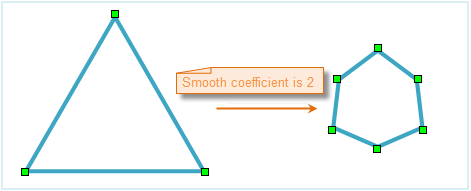
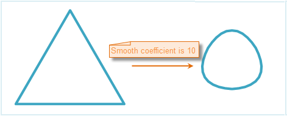
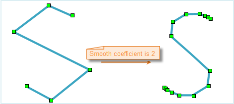
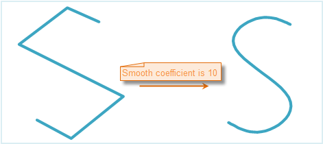
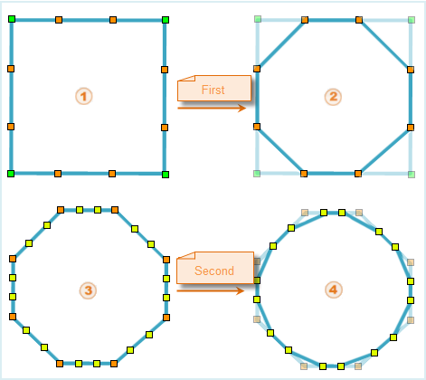

There two smooth methods for line and region datasets are provided by current SuperMap UGC (Universal GIS Class): B Spline and POLISH.

### 1. Use the B Spline to smooth

Smooth coefficient is the parameter that controls the smoothness. In B Spline, it is the number of segments after inserting the points in the segment.

When smooth the unclosed segments, please keep the shape of original curve. The methods are: Keep the stat and end points the same and add the section number of insertion points (it is usually twice of the smooth coefficient).

Set the smooth coefficient and it is valid when the value is greater than or equal to 2. the larger the value is, the more nodes the line objects or region objects are. It is recommend to get the value in [2, 10].

There are two methods for calculating the B Spline intersection number:

* If the segment is closed, the node number = (number of control point - 1)* smooth coefficient + 1
* If the segment is unclosed, the node number = (number of control point + 1)* smooth coefficient + 1
* The control point can be construed as the real node number in line object before smoothing.
1. The following is the insertion points when the closed line smooths.

When smooth the closed line, the smooth coefficient is set to 2, namely, insert one point and segment them into two.

There are 4 points before smoothed, and 7 points after smoothed.

The smooth coefficient is set to 10 when smooth the closed line and the effect is as follows.

2. The following is the status of insertion points when smooth the unclosed lines.

When smooth the closed line, the smooth coefficient is set to 2, namely, insert one point and segment them into two. The star and end is divided into 4 segments (insert 3 points).

There 6 points before smoothed, and 15 points after smoothed.

The smooth coefficient is set to 10 when smooth the unclosed line and the effect is as follows.

### 2. POLISH

The POLISH is a smooth method that it is simple and the processing speed is faster. But the effect limits. It mainly inserts two points into the segment, namely, divide the original segment into three parts, then connect contiguous insertion points of original node into line. Erase the angle of node in original geometric objects. The content above is a POLISH process.

The smooth coefficient is the times of polish. The higher the value, the more the insertion points in result object . And the result is close to smooth.

1. The following is the process that smooth closed quadrilateral by polish method. The coefficient is 2.

2. The processing of unclosed line is the same as above. The start and end node keep the locations.
  
