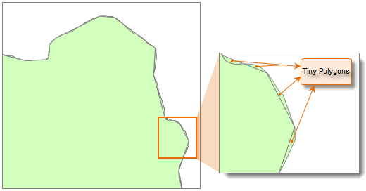
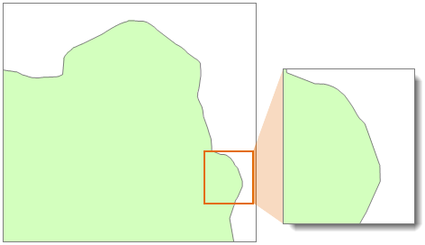
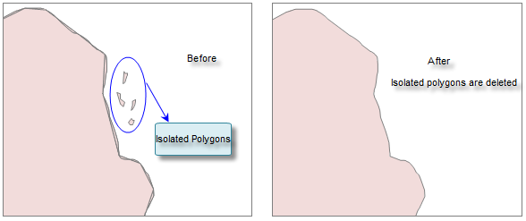

### Introduction

Merge the tiny polygons to larger polygons.

In the data processing, some tiny polygons were created, and we call them Tiny
polygon. You can merge these tiny polygons to adjacent polygon, or delete the
isolated polygon.

Generally speaking, the polygons that the area is much smaller than other
region objects is the tiny polygon. You can set the minimum polygon tolerance
according to the needs. The vertex tolerance is used to determine whether the
polygon is adjacent. If you set a high tolerance for the region object or the
polygon, it may fail to merge the tiny polygons.

The following is the result that a region data eliminates the tiny polygons.
The figure 2 is the effect that the tiny polygon merged to the big polygon.

 Figure 1: Before eliminating tiny polygons
  
 Figure 2: After eliminating tiny polygons  
  
For the isolated polygon that the area is less than the specified minimum
polygon tolerance, you can select Delete Isolated Polygon, as shown below:

  
  
### Function Entrances

* **Data** tab > **Data Processing** > **Vector** > **Eliminate Tiny Polygons**.
* **Toolbox** > **Data Processing** > **Vector** > **Eliminate Tiny Polygons**.(iDesktopX)

### Parameter Specification

In the **Eliminate Tiny Polygons** dialog box add your datasets and set required parameters.

* **Node Snap Tolerance** : If the distance between two nodes are less than this tolerance, they will be merged into one node.
* **Min Polygon Area** : A polygon with an area less than this value will be considered as a tiny polygon. The system will set the value to the one millionths of the maximum object. You can reset the value, it is recommended the value range it one millionths to one ten-thousandth of the area of the maximum object. A red mark will be displayed if the value exceeds the range, you can view the minimum value and maximum value by double-click the mark. 
* **Delete Single Region** : if there are isolate polygons (not intersecting or tangent to other polygons), the system will delete these polygons automatically.

