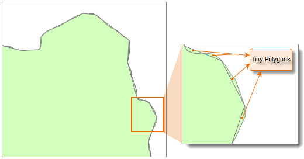
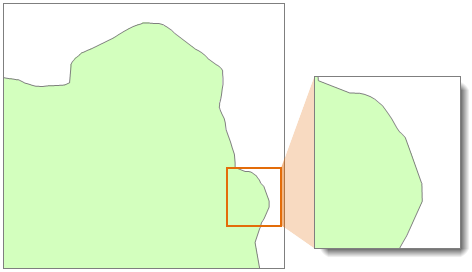
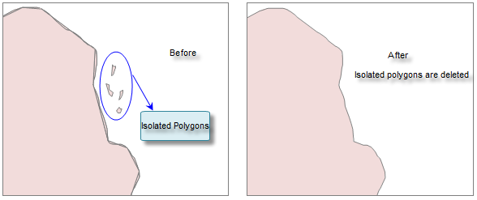

### Introduction

Merge the tiny polygons to larger polygons.

In the data processing, some tiny polygons were created, and we call them Tiny polygon. You can merge these tiny polygons to adjacent polygon, or delete the isolated polygon.

Generally speaking, the polygons that the area is much smaller than other region objects is the tiny polygon. You can set the minimum polygon tolerance according to the needs. The vertex tolerance is used to determine whether the polygon is adjacent. If you set a high tolerance for the region object or the polygon, it may fail to merge the tiny polygons.

The following is the result that a region data eliminates the tiny polygons. The figure 2 is the effect that the tiny polygon merged to the big polygon.

 |   
---|---  
Figure 1: Before eliminating tiny polygons | Figure 2: After eliminating tiny polygons  
  
For the isolated polygon that the area is less than the specified minimum polygon tolerance, you can select Delete Isolated Polygon, as shown below:

  
Figure: Delete isolated polygons  
  
### Basic Steps

  1. In the Data tab, click Union Pieces in the Data Processing group, the Eliminate dialog box appears. 
  2. Add the dataset to perform tiny polygon union in the list box, and assign values unified. 

 Toolbar description

  *  : Click Add button, the Select dialog box appears, select the dataset to add.
  *  : Click Select All button to select all the records in the list box.
  *  : Click Select Inverse, the originally not select records will be selected, and the originally selected records will become not selected.
  *  : Click Remove button to remove one or more records in the list box.
  *  : Click Advanced to assign the datasets by batch. Set parameters like Node Snap Tolerance, Sliver Polygon and Delete Slivers.

  3. Set related parameters in the list box, including Node Snap, Sliver Polygon and Delete Slivers. 
  * Node Snap: If the distance between two nodes are less than this tolerance, they will be merged into one node.
  * Sliver Polygon: The polygons whose area are less than this value will be considered as tiny polygon to merge. The system will set the value as the one millionths of the maximum object, you can reset the value, it is recommended the value range it one millionths to one ten-thousandth of the area of the maximum object. A red mark will be displayed if the value exceeds the range, you can view the minimum value and maximum value by double-click the mark. 
  * Delete Slivers: Check it of the dataset, if there are orphan polygons (not intersect or tangency with other polygons), the system will delete these polygons automatically.
  4. Click OK to perform the merging operation or click cancel to given up the operation.