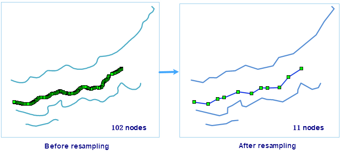

### Introduction

When the nodes of the object are too intensive, it is needed to resample the
coordinate data, according to certain rules to remove some nodes, in order to
achieve the purpose of simplifying the data. The dataset resamples support
line, face, and network datasets, and can process multiple datasets in bulk.

### Function Entrances

* **Data** tab > **Data Processing** > **Vector** > **Vector Resampling**.
* **Toolbox** > **Data Processing** > **Vector** > **Vector Resampling**.(iDesktopX)

### Parameter Specification

Add your dataset in the **Vector Dataset Resampling** dialog box. With the
toolbar you can perform a series of operations on your datasets including Add,
Select All, Select Reverse, and Remove.

* Set related parameters in the **Parameter Settings** area. 
* **Resample Method** : The application provides two resampling methods: Blend and Douglas-Peucher. To know more about the methods, please refer to [Resample](../Objects\\EditObjects\\ReSampleIntro).
* **Resample Tolerance** : It refers to the resampling tolerance, the greater the resampling distance, the simpler the sampling result data. The following two means support resampling distance: 
* According to the scale: Click the drop-down button, according to the display scale corresponding to the resolution distance set resampling distance, the distance standard from the "2011 Geographic Information Public Service Platform electronic map data specification". 
* Custom: The user can enter the resampling distance in meters in the value box according to the actual demand.

Note: It should be larger than 0.0000000001 and less than 1/10 of the dataset extent.

* Reserve Small Geometry: Small Geometries are the region objects whose areas are 0 after resampling, it only works on region objects; When it is checked, the border of the small geometries will be retained.
* **Pre-process Data** : You can check this option and set Node Snap tolerance to perform topology preprocessing on complex region datasets. When the dataset is resampled, the line dataset and the network dataset do not need topology preprocessing. The region dataset can choose whether to perform topology preprocessing. Topological preprocessing preserves topological relations of region datasets to ensure that no gaps occur when resampling of common borders. 

The default value for the tolerance is related to the coordinate system of the
dataset. For details, please check [Tolerance
Introduction](../Tolerance).

It is mainly used to work with intersection and adjacent region geometry
object; when there are different numbers of nodes on the two sides of the
adjacent or intersection border, and the distance from the node to the
neighbouring border is less than the node snap tolerance, the two sides will
be merged by location, the number of nodes will be added to the same.

Since this operation is done on the source dataset directly, a prompt "Note:
The operation will modify the dataset to be resampled" will appear when you
check it, if you don't want to modify the source data, please backup before
performing the operation.

* **Result Dataset** : Check this check box to save the resampled result dataset and set the datasource and name of the result dataset. If you do not check this option, it means to resample the source data. It is recommended to back up the dataset in advance.

