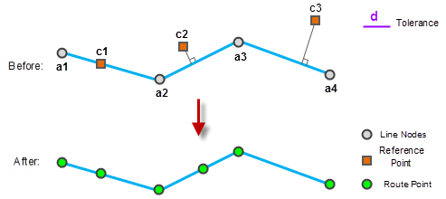
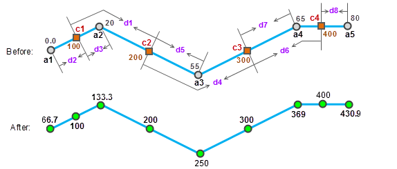
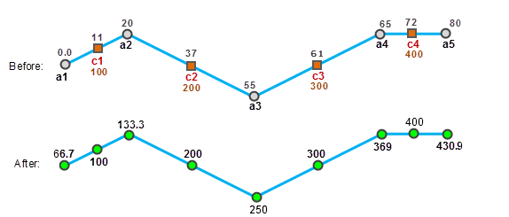

Calibrating route is used to ensure the correctness of the measurement, and
ensure the events can be located accurately. For example, the route data
represents freeway has m-values represents the mileage information, but the
m-values may be not accurate. Surveyors collect points every 200 meters along
the freeway and record the mileage. The data collected can be used as
referencing points to calibrate the existing freeway route data.

### The calibration process

Calibrating route is the process of adjusting the m-value of the route with the m-value of the referencing points.

  1. The route data and referencing points can be associated by the route ID field.
  2. If a referencing point is coincident with a vertex of the route, the measure value of this vertex uses the measure value of the referencing point.
  3. The m-values of vertexes on the route that are not duplicate with referencing points can be got by interpolation with the m-values of the referencing points within the calibrating tolerance. 
  4. The referencing points outside of the calibrating tolerance will not be used in the calibration.
  

### Calibrating types

Two calibrating types are provided: Calibrating by distance and calibrating by measure.

* **Calibrate by distance**

Calibrating the m-value based on the distance between two points along route. The result will be monotonic, that is the m-values will be increasing or decreasing.

  
Steps:

  1. For the node a1, use c1 and c2 to calibrate. First calculate the distance between d1 c1 and c2 and then calculate the calibration ratio R1 = d1 / (200-100). Note that all distances mentioned here refer to the distance along the line.
  2. Then calculate the distance between d2 a1 and c1, then there is d2 / (100-M  a1 ) = R1, then the M value for a1 after calibration is 100 - d2 / R1. 
  3. Similarly, use c1 and c2 to calibrate a2. First calculate the distance between d3 c1 and a2, then calculate the calibration ratio R2 = d1 / (200-100), then there is d3 / (M  a2  -100) = R1, and the M value for a2 after calibration is 100 + d3 / R1. 
  4. And so on, use c2 and c3 to calibrate a3, use c3 and c4 to calibrate a4 and a5. Note that the calibration ratio is always calculated by using the two nearest reference points. 
  5. The M values for all the route vertices on the route after calibaration are shown in the above screenshot. 
* **Calibrate by measure**

Calibrate based on the corresponding route location measure value of the referencing point. This method can keep the change rule of the original route data measure value (such as increasing decreasing or spirals). This method is very useful for the fine tune of the m-values when the ratio of the route length and the m-value are different.

 
  
Steps:

  1. Use C1 and c2 as reference points to calibrate the node a1. First, calculate the calibration ratio of the M value: R1 = (37.5-10) / (200-100), wherein (37.5-10) is called line measure difference between c1 and c2 along the line they are on. 
  2. The line measure difference between a1 and c1 is (10-0), and we have (10-0) / (100-Ma1) =R1, so the M value for a1 after calibration is: 100 - (10-0) /R1. 
  3. In the same way, use c1 and c2 to calibrate a2. First calculate the calibration ratio: R2= (37.5-10) / (200-100), The line measure difference between a2 and c1 is (20-10), then we have (20-10) /(Ma2-100)=R2, so the M value for a2 after calibration is 100+ (20-10) /R2. 
  4. And so on, use c1 and c2 to calibrate a2, use c2 and c3 to calibrate a3, and use c3 and c4 to calibrate a4 and a5. Note that the calibration ratio is always calculated by using the two nearest reference points. 
  5. The M values for all the route vertices on the route after calibration are shown in the above screenshot. 

### Note

Calibrating route needs at least 2 reference points.
