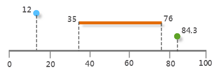
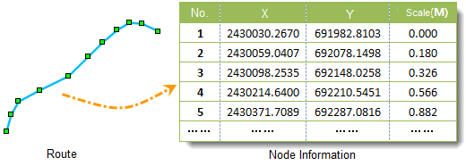
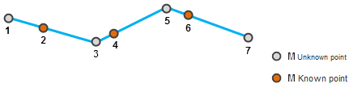

### Linear Referencing

Linear referencing is a method for describing and storing geographic positions with the relative positions along linear features that have measure values. Distance measurement is used to locate events along lines, and the events can be attributes like length, time, cost, etc. As a common dynamic positioning technology, linear referencing is used in areas like the data acquisition of linear features like roads, railways or rivers, the management of public transportation system or pavement condition, and the imitation of distribution networks (like power grids, telephone lines, TV cables, water supply and drainage pipes, etc.).

Linear referencing is used for the following reasons:

  1. In real life, positioning with distances along lines fits our habits more than positioning with precise coordinates. For example, to say "An accident happened in 300 meters east to the corner" is easier for positioning than to say "at the point with the coordinate (6570.3876,3589.6082)".
  2. Linear referencing can be used to associate linear features with attribute tables, and there is no need for split the line data where the attribute values change.

As shown below, the line in gray represents the mileage of the freeway with measure value, and the points and line segments on it represent two kinds of events: Two accidents happened on the freeway with the locations 12 kilometers and 84.3 kilometers, and road surface collapse happened between 35 kilometers and 76 kilometers.

  
 
### Linear Referencing

Dynamic segmentation is not the physical segmentation at the location where certain attribute of the line feature changed. It uses linear referencing technology on traditional GIS data models, and stores the attributes and their corresponding linear feature location in an independent event attribute table (event table). It segments the linear features with dynamic logic segmentation method based on the distance stored in the event attribute table and automatically calculate the spatial positions of the attribute data in the analysis, display, query and output operations.

In short, dynamic segmentation is a process for dynamically displaying linear referencing features, and it is an application of linear referencing technology. Dynamic segmentation builds up the associated relations between any segment on the linear features and multiple attributes without changing its original spatial data structure.

### Basic Concepts

In SuperMap, there are two types of data structures for dynamic segmentation: Route and event table. Route is used to represent line object with measure values, and event table records the location of the events occurred along the route and other attributes.

* **Route**

Route can be any linear feature that has ID and measure system, such as a road, street, river, pipe, etc. Each vertex on the route has a measure value (m-value) which represents the distance between the current point and the start point.

* **Measure Value**

Measure value is also called m-value, it represents the distance between one point on the route to the start point. It is independent from the coordinate system of the feature classes. The unit of the measure value isn't necessary to be the same with that of the feature class.

  

* **Route Position**

Route position describes a "point" on the route or a "section" along the route. The position of a point on a route is described by the ID field of the route and a measure value, and the position of a line on a route is described by the ID field of the route and two measure values: From measure and to measure.

* **Route Dataset**

Stores line data. Each vertex on the line object has a measure value (m-value) in addition to geographic coordinates. Route dataset can be created by lines and the points on them.

* **Event**

When the route positions and their associated attributes are store in one table, a route event will be organized, which is called event for short. There are two kinds of events: point events and line events. Events are stored in event tables.

* **Point Event**

Point event is an accurate point on a route, such as a mileage point on the road, or an accident point on the railway, etc.

* **Line Event**

Line event describes a part of a route, such as a certain segment of the road in maintenance.

* **Zero-length Event**

A line event whose from measure and to measure are the same.

* **Event Table**

An event table contains the event location and its related attributes. There are two kinds of route event tables: point event table and line event table.

* **Interpolation**

Use known measure values of vertexes on route object or external data to estimate the measure value of other vertexes. Interpolation methods include interpolation and extrapolation.

Interpolation is to estimate the middle values between known values, and extrapolation is to estimate the values beyond the known values. As shown below, the m-value of vertex 1 can be got by extrapolation with the values of vertexes 2 and 4, and the m-value of vertexes 3 and 5 can be got by interpolation with the values of vertexes 2, 4 and 6, and the m-value of vertex 7 can be got by extrapolation with the values of vertexes 4 and 6.
  
