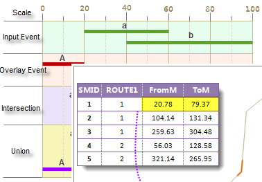
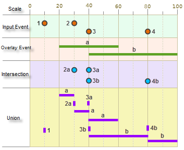
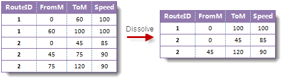
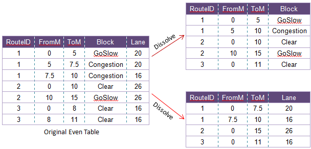
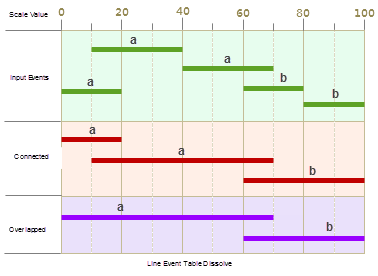
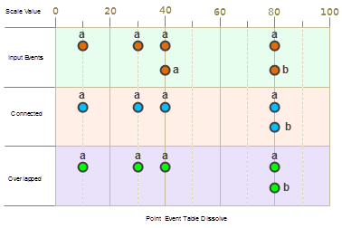

Besides the displaying and creating of event table, the dynamic segmentation function in SuperMap supports event table analysis functionalities, including overlaying events and dissolving events.

### Overlaying events

Overlay all the events in the input event table and the overlay event table. The operation can be either intersection or union, and the result is a new event table. The input event and the output event must have the same route ID.

Analysis the result event table can help us solve same problems that traditional spatial analysis technology can't. For example, in a traffic accident data, two event tables are used to record the width of pavement where the accident happened and the speed of the motor vehicle. Overlay the two event table, the result will be an event table that records the width of the pavement and the speed of the motor vehicle. You can get the information about the traffic accidents from the result event table quickly, for example, the accidents happened where the width of the pavement is less than 10 meters and the speed of the accident vehicle is larger than 70.

There are two methods for overlaying event tables: events intersection and events union.

  * Intersection: The events with the same route ID will be split at the intersecting point, and only the overlapping events will be output to the result event table.
  * Union: Splits all events at their intersections and output them to a new event table.

Event table overlaying supports line-line overlaying, point-line overlaying and point-point overlaying. Since point-point overlaying is rare in real application, here only line-line overlaying and line-point overlaying are introduced.

  * **Line-line overlay**

The result is a new line event table. The figure below shows the line-line overlay. Note that a zero-length event will be created if an input event and an overlay event are in an end to end status.

  

* **Line-point overlay**

A point event table will be created for intersection. Note: For intersection overlay, the results for point-line overlay and line-point overlay are all point event tables. The union overlay will create a line event table, and zero-length events will be created at the intersection of the point events and line events.

The following figure shows the overlay of a point event table and a line event table.

  

### Dissolving event tables

1. **Introduction to dissolving event tables**

Combine events that have the same route ID and dissolving field values (only
the events with the same dissolving field values can be dissolved). This
function can be used to remove redundant information of event tables or break
up event tables having more than one descriptive attribute into separate
tables.

   * Remove redundant data by dissolving event tables 

As shown below, in a freeway speed limit event table, the Speed field records
the speed limit values. Neighboring segments may have the same speed limit,
but are represented by two events, and this will result in redundancy. You can
remove the redundant data by concatenating event tables. If the events overlay
with each other. You can also remove the redundant data by combine events.

  
---  
   * Split event table 

A event table may records several attributes of the events with multiple
attribute fields. You can split an event table to several event tables by
specify different fields and perform the dissolving operation. As shown below,
in an traffic accident event table, Block and Lane record the block up status
and the width of the road respectively. Perform the dissolving operation twice
for the event table, two event tables will be created, one describing the
block up status of certain moment, the other records the width of the road.

  
---  
2. **Dissolving types**: There are two types of dissolving: Concatenate and overlap.
  * Concatenate: The two events with the same route ID and dissolve field connected end to end can be merged into one event for the result event table.
  * Overlap: The overlap of the two events with the same route ID and dissolve field are written to the result event table.

Both line events and point events support dissolving. The following shows the
concatenating and overlaying of event table. The events have the same route
ID, and the labels represent the dissolving field values. Only the events with
the same dissolving fields will be dissolved.

  

  

  
Whatever it is concatenate or overlap, the dissolving results are the same.

### Note

Reasons for overlapping failed:

  * The events for overlaying are not based on the same route reference.
  * The parameters for the event table are wrong. e.g., the measure value is null.
  * The current datasource is read only.
