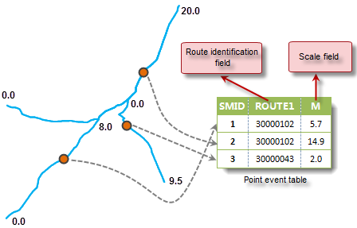
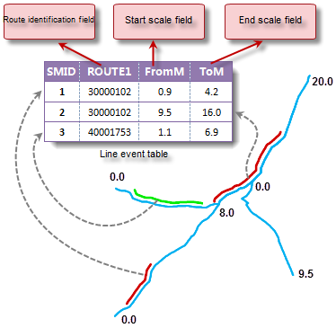
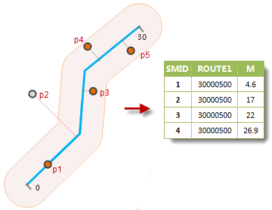
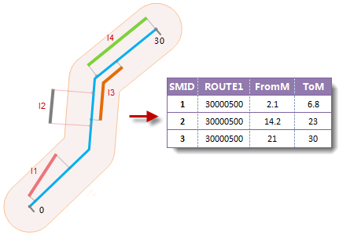

### Event table types

There are two types of events: Point event and line event, they are stored in point event table and line event table respectively.

  * **Point event and point event table**

Point event is an accurate point that happened in a route, such as an accident
point on the road, a chronograph on the freeway, a valve on pipeline, etc. In
a point event table, each point event has a corresponding route ID, and a
measure field describing the location of the point event.

  

* **Line event and line event table**

Line event describes a segment along a route, such as the pavement of a road,
the traffic condition of a street or the pipe diameter of a pipeline, etc. As
shown below, in a line event table, each line event must contain a route ID,
and use from m-value and to m-value to store its location.

  
  
From measure field: Stores the m-value of the start point of the line event on the route.

To measure field: Stores the m-value of the end point of the line event on the route.

### Creating event table

It is the process of creating event table that contains point events or line
events. You can input information to an event table manually or create an
event table with existing point, line and route dataset.

  * **Creating point event table**

A point event table can be created with point data and route data. Create a
buffer for the route object with the given radius, and the area is called
search extent. Points that fall in the region are used to create event table,
each point corresponding to an event. No events will be created for points
that fall outside of the search extent. The point data will have two new
attribute fields to save route ID and m-value respectively.

  
  
  * **Creating line event table**

Similar to the creating of point event table, if an entire line object falls
in the search extent, a line event will be created for it, the attribute
fields include route ID, from m-value and to m-value. No line events will be
created for lines not in the search extent or partly in the search extent. The
following figure shows the creating of line event table, the maximum straight-
line distance between line L2 and the route is larger than the search radius,
so no event will be created for it.

  
