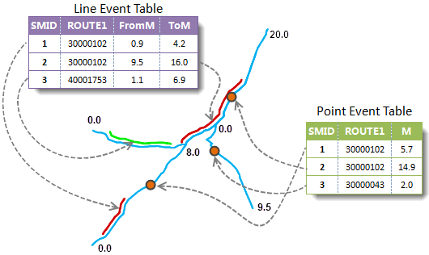

Three data types are used in creating spatial data: Route dataset, event table and spatial data. The corresponding relations between them are stored automatically when creating spatial data. The relations are built based on information like route ID fields and measure fields. Note that the route dataset, event table and spatial data must in the same datasource.

  
  
When one of them (the event table, for example) is changed, the other data (the spatial data) will change automatically.

### Relations Management

Spatial data and event tables are in one-to-many relationship, and route dataset and spatial data are in one-to-many relationship, and an event table and spatial data are in one-to-one relationship. In the figure on the left below: The datasource LinearReferencing, Route is a route dataset, SpatialData_1, SpatialData_2 and SpatialData_3 are the spatial data created by Route and event tables Event_1, Event_2 and Event_3 respectively. There are three dynamic segmentation relations in the datasource, as shown in the figure on the right.

  

### Relations Association

The dynamic segmentation relation is built when spatial data is created.

The following associated modifying is supported currently in SuperMap:

1. **The change of the description information. Inter-association between the event table and the spatial data.**

Modify event description information means modify general attribute fields (not route ID field or measure field), for example, the speed limit information of a road. When modifying the descriptive information in the event table, the attribute information of the spatial data will be modified at the same time. When modifying the fields of the spatial data attributes, the corresponding event table will be modified at the same time.

2. **The route position change of events. Inter-association between the event table and the spatial data.**

Changing the route position of events means changing the m-value filed of the event table or spatial data. When changing a m-value in the event table, the geometric and attribute information of the corresponding line/point object will be changed at the same time; when changing the m-value of the spatial data, the corresponding geometry will be changed at the same time, so was the m-value of the corresponding event in the event table. For line event, change the from-measure or to-measure may change the length and location of the event. In the figure below, the measure values of the first event is (20.78,79.37), when changed to (150.00,180.00), the spatial data is changed at the same time.

  
  
Note: If there is no intersection between the m-value changed and the corresponding route m-value, the geometry of the spatial data will not change, for example, the from-measure and to-measure changed is (26,60), and the measure of the corresponding route is (3,20); if part of the line event changed is on the route, the geometry on the spatial data will be changed to the intersection part.

3. **The change of the route. In this case, the spatial data and the event table will change as the route changed. But when changing the spatial data, the corresponding route data will not be changed, only the event table will be changed.**  This case is suit for the data error or data change. There are three situations:
    * When changing the geometry of a route object, the corresponding geometry in the spatial data will be changed at the same time. 
    * When changing the route ID of an event, the geometry and attribute information in the spatial data will be changed at the automatically. In the figure below, when changing the route ID of the first event, the spatial data is changed at the same time.     Note: A route ID value of the route dataset can be changed, but the event table and spatial data won't be change automatically.
    * When changing the event table structure, the attribute table of spatial data will be changed automatically.

The change of the structure of the event table refers to adding or deleting fields. In this case, the structure of the attribute table of spatial data will be changed, too.

### Note

  1. The event table used to create spatial data must contain route ID field and measure field.
  2. A field Event_SMID recording the SMID of the corresponding event will be add to the spatial data created. Change this field may lead to error in the association.
  3. Since there is a one-to-one relationship between the event table and spatial data. If an event table already has a dynamic segmentation relation, you cannot create spatial data for it again.
  4. If the dynamic segmentation relation is built, when deleting data (route dataset, event table or spatial) directly, a dialog box will popup asking whether to delete the association relation and the dataset. The dataset can be deleted only when the association relation is deleted. 
