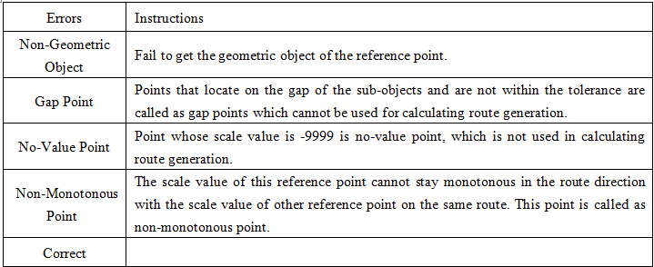

---
id: CreateRoute
title: Creating Routes
---  
Creating route dataset is the first step of dynamic segmentation.

A route dataset can be created by associating a point or line dataset with a measure field. Edit of objects in the generated dataset is allowed.

### Instructions

Four methods of creating route dataset are provided in : Line reference point measure, line single field, line dual field and line length.

* **Line reference point measure** : Create route dataset with line data and reference point data. Project reference points to line datasets with route identifier field, and then determine the m-values of vertexes on the line data with the m-values of the reference points.  There are three types of location relations between the reference points and the vertexes on the line data.
    1. The measure value of a reference point is assigned to a vertex on the line if the reference points coincide with the vertex, or the distances between them are within the given tolerance. When there are more than one reference points in the tolerance, the measure value of the closest reference point will be used.
    2. For the reference points whose distances to vertexes of the line dataset are not within the tolerance, if the distance between a reference point to its corresponding arc is less than the tolerance, the reference point will be viewed as on the line and the measure value of it may be used to calculate the measure value of the vertexes; if the distance is larger than the tolerance, the measure value will not be used to calculate the measure value of the vertexes.
    3. When there are no reference points near a line, that is there are no reference points within the tolerance of the vertexes and there are no reference points on the line dataset, no route will be created for the line object. The number of routes created will not be the same with the number of the original line objects.    
* **Line single field**

Create route dataset with line data which has an attribute field records the
measure values. The measure values are used as the To measure values of the
corresponding routes, and the From measure values of the route is 0, if there
are median vertexes, their measure values will be calculated by interpolation.
The number of objects in the route dataset created is the same with the
original line dataset. (The To measure value is the measure value of the last
vertex on the route, and the From measure value is the measure value of the
first vertex on the route.)

* **Line dual field**

Create route dataset with line data which has two attribute fields recording
the measure values of the from vertexes and the to vertexes. The measure
values of median vertexes are got by interpolation.

* **Line length**

Create route dataset by using the lengths between the vertexes of line objects
and the first vertexes as the measure values. The number of objects in the
result route dataset is the same with that of the original line dataset.

### Function Entrances

  * **Traffic Analysis** > **Dynamic Segmentation** > **Dynamic Segmentation** > **Workflow Manager** > **Generate Route** button. (iDesktop)
  * **Traffic Analysis** > **Dynamic Segmentation** > **Dynamic Segmentation** > **LineM** > **Generate Route** button(iDesktopX)
  * **Toolbox** > **Traffic Analysis** > **Dynamic Segmentation** > **Generate Route**. You can click on the tool directly or drag it into the geoprocessing modeler window. (iDesktopX) 

### Parameter Description

  * **Generateion Method** : for different methods, the required parameters are different. Below content introduces the same parameters first.
  * **Source Dataset** : Select the datasource and dataset that contains the line data to be used and the route identifier field.
    * For **Line Single Field** , **End Measure Field** is required.
    * For **Line Dual Field** , both **Start Measure Field** and **End Measure Field** are required.
  * **Parameter Settings** : 
    * **Measure Offset** : After the measure offset is set, all the measurements in the route will be offset. For example, if a node measure is 0.09, set the offset to 10, then the measure of this node in the dataset is 10.09. The default value is 0, that is not offset.
    * **Measure Factor** : Used for the unit conversion of measure values. For instance, to convert the unit of the measure meter to kilometer, the measure factor should be set as 0.001. The default value is 1, that is do not convert.
    * **Ignore intervals between subobjects** : The route may contain multiple subobjects. If the two subobjects are not connected, a gap will occur. If the interval is ignored, the measure values are continuous. 

As shown below when **Ignore intervals between subobjects** is checked, the
m-value of the last vertex of the first subobject is the same with that of the
first vertex of the second subobject; when it is not checked, the m-value of
the first vertex of the second subobject is the last vertex m-value of the
first subobject plus the straight-line distance between them.

  

  * **Reference Point Dataset** : Set the parameters of the reference point dataset. 
    * Select the datasource and dataset that contains the reference point data, the route ID field, measure field, and error field.
    * **Error Info Field** : Select the field to save the error information, or input a name to create a new field to save the error information. If error occurred during the creating processing, the error information will be saved in the field. The error info field will be added to the attribute table of the reference point dataset automatically. The table below lists the possible errors:    
 
    * **Tolerance** : The reference points not in the tolerance will not be viewed as points on the path, and will not be used in the calculating of m-values. See [Line Reference Point Measure](CreateRoute) for more information. Default tolerances relate to coordinate systems of datasets, for detail descrition, please refer to [Tolerance](../../Features/DataProcessing/Tolerance).
  * **Result Data** : Select the datasource to save the route data and set the name of the route dataset.
  * When the setting finished. Click **Ready** , it's ready to perform the current step. The finished flow will be gray and cannot be modify directly. If you need to modify the parameter settings, click the **Cancel Ready** button. (iDesktop)

Note: Click the **Ready** dropdown button, the **Cancel All** button appears, it is used to cancel the ready status of all the steps.

  * After the current step is ready, click **OK** to perform the operation.

### Edit Route

Generated route dataset can be edited. The editing operations include: Line
Split, Region Split, Object Split, Split, Accurate Split, Smooth, Resample,
Union, Join, etc. For more details about editing objects, please refer to
[Edit Objects](../DataProcessing/Objects/EditObjects/EdittingGeometry).

**Note** : After extending a route object, the M-value of extended part needs correcting by yourself.
