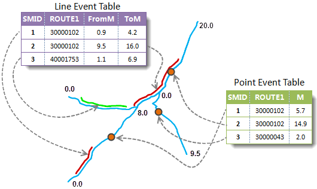
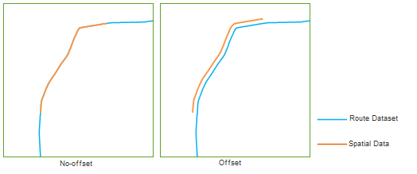

### Instructions

Event table records the route ID, measure, and descriptive information of
point/line events in form of event table, such as weather condition,
alcoholicity of the driver, speed, width of the road and pavement when the
traffic accident happens. Creating spatial data is locating the events based
on route dataset and generating point or line data.

Three data types are involved in the creating of spatial data: Route dataset,
event table and spatial data. The dynamic relation between them will be
created automatically. Since event table and spatial data have one-to-one
relationship, make sure the event used to create spatial data does not have
dynamic relation. If an event table already has in a dynamic relation, it is
needed to delete the relation before create the spatial data.

  

  
For more information about dynamic segmentation relation, see [Relations Management](AboutRelationManage).

### Function Entrances

  * **Traffic Analysis** > **Dynamic Segmentation** > **Dynamic Segmentation** > **Workflow Manager** > **Generate Spatial Data** button. (iDesktop)
  * **Traffic Analysis** > **Dynamic Segmentation** > **Dynamic Segmentation** > **LineM** > **Generate Spatial Data** button(iDesktopX)
  * **Toolbox** > **Traffic Analysis** > **Dynamic Segmentation** > **Generate Spatial Data**. You can click on the tool directly or drag it into the geoprocessing modeler window. (iDesktopX) 

### Parameter Description

Select the event table to use, and the datasource that contains the route
data. Note that the event table and the route data must in the same
datasource.

* **Event Table Data** : Set parameters related to event table data, including event table, event type, route ID field, measure field, offset field and error info field. Note: Only is one measure field needed for point event.
* **The offset field**
    * The offset field value is used to move the spatial data (point or route object) created.
    * If the offset value is an active value, the spatial data created will move left along the route; if the offset value is an negative value, the spatial data will move right along the route. The following is the comparison of the spatial data created.
    * Note: The order of the route vertexes determines the direction of the route. The direction of the route is the increasing direction of the vertexes.    
  
* **Error Fields Introduction**
The error field is written to the source event table directly, which is used
to describe error messages why can't create the corresponding point or line.
See [Error Field Introduction](ErrorInfoField)

  * **Route Data** : In the Route Data region, select the datasource and dataset that contains the route data, and then select the route ID field.
  * **Result Data** : In the Result Data region, input the name of the spatial data.
  * When the setting finished. Click **Ready** , it's ready to perform the current step. The finished flow will be gray and cannot be modify directly. If you need to modify the parameter settings, click the **Cancel Ready** button. Note: Click the **Ready** dropdown button, the **Cancel All** button appears, it is used to cancel the ready status of all the steps.(iDesktop)
* After the current step is ready, click **OK** to perform the operation.

### Note

If there is spatial data created with an event exists in the current
datasource, you cannot create new spatial data for it, unless you delete the
existing spatial data in the manager window.
