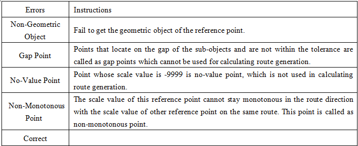
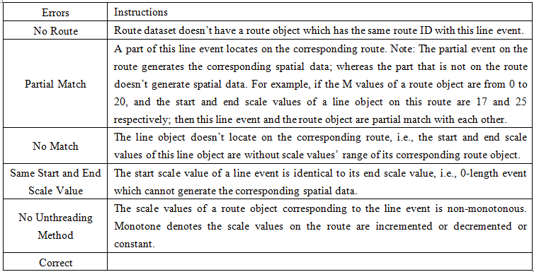

### Introduction

The error information field is written into the event table directly, which is
mainly used to describe the error information that the event cannot generate
the corresponding point/line.

Not all the events can generate the spatial data successfully. There are
generally several types of errors that cannot be located. If the error
information field is set, then after the spatial data is generated, the
application will automatically add this error filed into the event table and
write the error information.

  * When the generated spatial data are points, there are several types of errors as follows:  
  
    
  
  * When the generated spatial data are lines, there are several types of errors as follows:  
  
    
  
