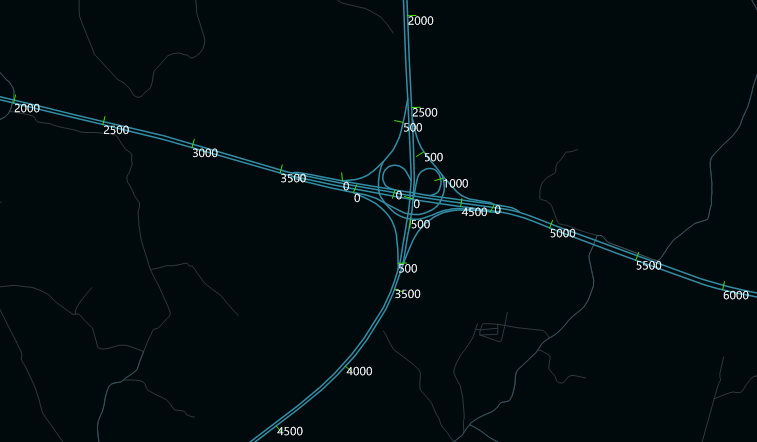

### Instructions

Extract Scale values of your route data based on an interval. The extracting
result is a point dataset which can be used to identify M-value on a map to
know about the value of every route.

### Function Entrances

  * **Traffic Analysis** > **Dynamic Segmentation** > **Dynamic Segmentation** > **Extract M-Value** button. (iDesktop)
  * **Toolbox** > **Traffic Analysis** > **Dynamic Segmentation** > **Extract M-Value**. You can click on the tool directly or drag it into the geoprocessing modeler window. (iDesktopX) 

### Parameter Description

  * **Source Dataset** : Set your datasource and dataset to be extracted.
  * Set the route identification field to identify the route objects corresponding with the result data.
  * Set the interval, if you set it 100 meaning the distance from start to the next route is 100 and then extracting scale values in turn. Such as: if the start route is 0, the extracted route scale values are 100, 200, 300, 400, etc. **Note** : If the distance between the last two route values is less than the interval, the last route value will not be extracted.
  * Specify a datasource to save the result and its name.
  * In the attribute table of the result dataset, there are some fields being added: Scale, Angle and the route Id field (from the source route data).
  

###  Related Topics

 [Query M-value](InquireRouteM)
