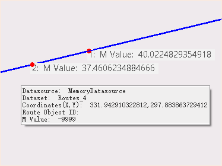

### Instructions

View the route M-value of a specify position in your layer.

### Basic Steps

  1. Add your route dataset into a map window, and then select the visible route layer in the Layer Manager.
  2. In **"Traffic Analysis"** tab, on the **"Dynamic Segmentation"** group, click the **"Query M-Value"** button. 
  3. Move your mouse into the map window, then a message box with route value information will appear. You can view the route value of route data anywhere by moving your mouse.    
  4. Left click on the object to add a point and show the route value of the point, meanwhile relative information such as the datasource, the dataset, coordinate values, and object ID, M-value will be shown on the Output Window.
  5. Click ESC to finish the query operation and clear all highlighted points. Or you can right-click your mouse to end your operation.

###  Related Topics

 [Extract M-value](ExtractRouteM)

