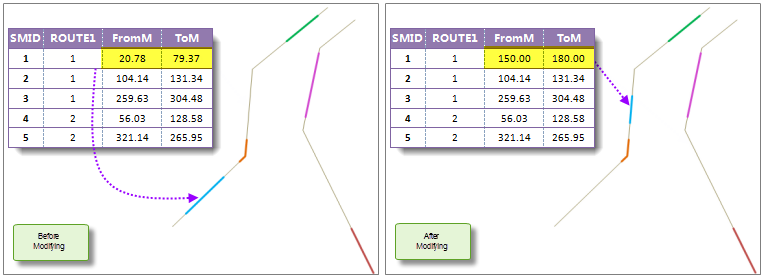
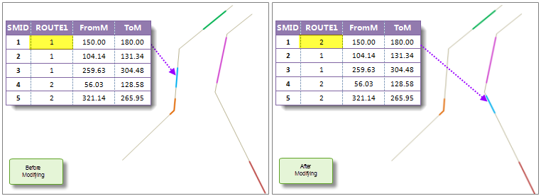
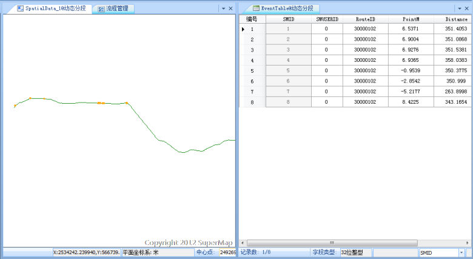

### Instructions

Associating is a main character of dynamic segmentation. When creating spatial data, dynamic segmentation relation will be built between the route dataset, event table and the spatial data. When modifying one of them, the other two data will be modified accordingly. The Associating relation makes it easier to modify event table and spatial data. For more information about dynamic segmentation relation, see [Relations Management Overview](AboutRelationManage).

The following are the dynamic association relations:

  1. **The change of the event table description information. Inter-association between the event table and the spatial data.**

Modify event description information means modify general attribute fields
(not route ID field or measure field), for example, the closing of a portion
of a road due to bad whether or construction. When modifying the descriptive
information in the event table, the attribute information of the spatial data
will be modified at the same time. When modifying the fields of the spatial
data attributes, the corresponding event table will be modified at the same
time.

  2. **The route position change of events. Inter-association between the event table and the spatial data.**

Changing the route position of events means changing the measure value of
event table or spatial data. When changing a m-value in the event table, the
geometric and attribute information of the corresponding line/point object
will be changed at the same time; when changing the m-value of the spatial
data, the corresponding geometry will be changed at the same time, so was the
m-value of the corresponding event in the event table.

For line event, change the from-measure or to-measure may change the length
and location of the event. In the figure below, the measure values of the
first event is (20.78,79.37), when changed to (150.00,180.00), the spatial
data is changed at the same time.

  
  
**Note**: If there is no intersection between the m-value changed and the
corresponding route m-value, the geometry of the spatial data will not change,
for example, the from-measure and to-measure changed is (26,60), and the
measure of the corresponding route is (3,20); if part of the line event
changed is on the route, and the to-measure is less than the maximum measure
of the route, the spatial data will be changed to the intersection part; if
the to-measure is larger than the maximum measure of the route, the change
will fail.

3. **The change of the route on which the event locates. In this case, the spatial data will be changed. But when changing the spatial data, the corresponding route data will not be changed. Only the event table and the spatial data are changing associated.**

This case is suit for the data error or data change. There are several situations:
  * When changing the route ID of an event, the geometry and attribute information in the spatial data will be changed at the automatically. In the figure below, when changing the route ID of the first event, the spatial data is changed at the same time.
  * When changing the route ID of spatial data, the corresponding route ID in the event table and the geometry of the spatial data will be changed at the same time.
  

### Basic Steps

  1. In the **Manager** window, double click a selected dynamic segmentation relation, the association window pop-up, as shown below. Or click the **Edit** button in the **Manager** window to edit the selected relation. For more information about dynamic segmentation, see [Relations Management](RelationManage).    
  2. The left part of the window displays the route data and spatial data, the right part displays the event table. When changing one data, the associated data will changing accordingly and displaying in the window in real time.
  3. Click **Close Current Window** to exit the current window.
