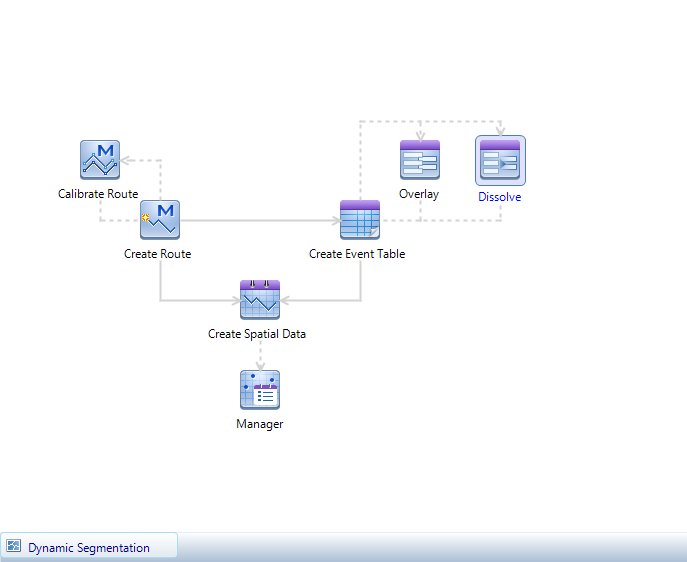

The dynamic segmentation functions provided by SuperMap include: Creating
route datasets, creating event tables, overlaying event tables, dissolving
event tables, creating spatial data and dynamic segmentation relation
management.

  
  
The flow chart above shows the steps of dynamic segmentation and their
relations. The main function buttons are connected with connectors. The two
functionalities connected by full line have parameters passing with the
direction of the arrow. The two functionalities connected by dotted line do
not have parameters passing between them. To use the dynamic segmentation
function, you just need to click the functionality button and set the
parameters, then perform the operation. For information about the procedure
management window, please refer to [Procedure Management
Introduction](../UIIntroduct/proceduremanage).

The steps of dynamic segmentation:

[1\. Creating Route](CreateRoute)

[2\. Calibrating Route](CalibrateRoute)

[3\. Creating event table](CreateEvent)

[4\. Overlaying Event Table](OverlayEvent)

[5\. Dissolving Event Table](DissolveEvent)

[6\. Creating Spatial Data](CreateSpatialData)

[7\. Relations Management](RelationManage)

### Related Topics

[Procedure Management Introduction](../UIIntroduct/proceduremanage)

