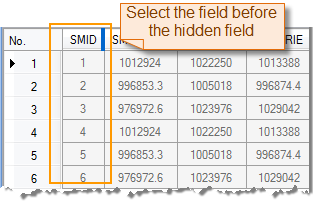
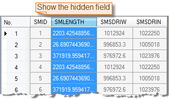

### Description

Unhide the columns that you have hidden.

### Basic Steps

  1. In the attribute table with blue marks on the table header, you can:
    * Select a column and click Show Column Hidden to show all column that you have hidden.
    * Select both column before and after the hidden column and click Show Column Hidden to show all hidden column between the two selected fields.
    * Click Show Column Hidden to show all column if there are no selectable column displayed.
  2. The corresponding blue marks disappear.
|    

### Note

  1. The Show Column Hidden command is only active if there are selected fields in the current attribute table.
  2. To know how to hide fields, please refer to [Hide Fields](HideButton.htm).

[Sort Ascending](SortOrderAscendingButton.htm)

[Sort Descending](SortOrderDescendingButton.htm)

 [Hide Column](HideButton.htm)

 [Hide Row](HiddenRows.htm)

 [Show Hidden Rows](CancelHideRows.htm)

[Filter](FilterButton.htm)

[Locate](GoToButton.htm)

 [Show Hexadecimal](DisplayHexadecimal.htm)

