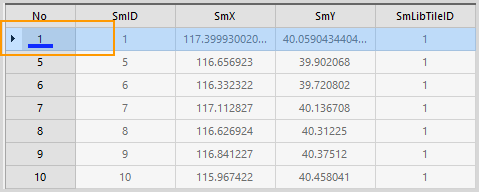
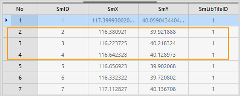

### Introduction

It is used to display the hidden rows.

### Basic Steps

  1. In the attributes table with hidden rows (there is a tag, for related tag please see [Hide Row button](HiddenRows.htm)):
    * Users can select the previous row of the hidden rows, click Show Hidden Rows to show all the hidden rows after the selected row.
    * Users also can select the previous and next row of the hidden rows, click Show Hidden Rows to show hidden rows between them.
    * If there is no row to be selected, it means all rows are hidden, and click Show Hidden Rows to show all hidden rows.
  2. After the hidden row is shown again, the hidden tag will be removed. 
|   

### Note

  1. Only after selecting a row, the Show Hidden Rows function is valid.
  2. About how to hide the rows, please see [Hide Row Button](HiddenRows.htm).

 [Sort Ascending](SortOrderAscendingButton.htm)

 [Sort Descending](SortOrderDescendingButton.htm)

 [Hide Column](HideButton.htm)

 [Show Hidden Columns](CancelHideButton.htm)

 [Hide Row](HiddenRows.htm)

 [Filter](FilterButton.htm)

 [Go To](GoToButton.htm)

 [Show Hexadecimal](DisplayHexadecimal.htm)

