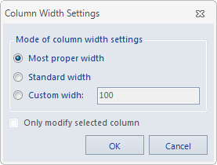

### Introduction

Sets the column width of the attribute table.

### Basic Steps

  1. Get attribute table: Right click a vector dataset in Workspace manager, Point to Browse Attributes on the context menu, if the dataset is a tabular dataset, double click it to open the attribute table.
  2. Click Attributes>System Settings>Column Width to prompt the Column Width Settings dialog. To modify the width of some specific columns, select the entire column or any cell in the column, which can be used in conjunction with the CTRL or shift key to select, and then click the Column Width button. 
  

  3. There are three setting modes: Only column width, Standard column width, and Custom column width as below: 
    * Suitable column width: The column width will be automatically adjusted based on the length of the cell contents and the field name. 
    * Standard column width: Attribute table column width is set to the standard width, SuperMap standard width is set to 100 pixels.
    * Custom column width: Enter the number of pixels in the text box on the right side. The column width range is [2, +∞), the pixel unit is generally an integer, so the input width should be integer. 
  4. If you check the "Only modify selected column", it will affect the selected column, otherwise, it will affect all columns.
  5. Click OK to finish.

  

