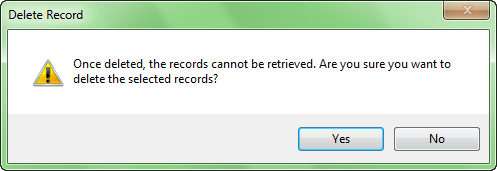

### Description

Delete one or more selected records in the tabular dataset or the attribute table of the vector dataset.

### Basic Steps

  1. Open a tabular dataset or the attribute table of a vector dataset. Right clicking the tabular or vector dataset in the Workspace Manager and clicking Browse Attributes.
  2. Select one or more records in the attribute table. Also, you can select cells in the records you want to delete.
  3. Right click and select Delete Record to display the Delete Record dialog box.     
  4. Click Yes to delete records.

### Note

  1. The associated geometric object will also deleted if you delete a reocrd.
  2. You can only add records for tabular datasets because only tabular datasets are not readonly.

###  Related topics
 [Copy and Paste](CopyAndPaste.htm)

 [Drag and Drop](DragTabular.htm)

 [Add Records](AddRecordsButton.htm)

 [Update Column](UpdateButton.htm)

 [Undo/Redo](UndoButton.htm)

 [Binary Edit](BinaryEdit.htm)

  

