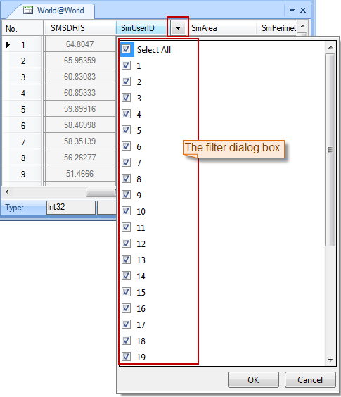

### Description

The Filter button allows you to filter out the records you don't want to display in the attribute table.

### Basic Steps

  1. Open an attribute table. you can right click a vector dataset in the Workspace Manager and click Browse Attributes. Or double-click the pure attribute table dataset.
  2. Select one or more fields in the attribute table. To select multiple fields, you can continuously click the field name while holding down the Shift or Ctrl key.
  3. On the Attributes tab, in the Browse group, click Filter. The selected fields are marked with drop-down arrows at the heads of the fields.
  4. Click the drop-down arrow next to the field name of a marked field to display the filter dialog box, in which all values in the field are listed. You can check the box before a value to show the records with this value and uncheck to hide.
  
 
  5. Click OK to filter out the records with unchecked values. To remove the filter operation performed on a field, select it and click Filter again.

### Note

  1. You can select multiple fields and click Filter to prepare all the selected fields for filtering.
  2. You cannot remove all filter operations at the same time. To remove the filter operations on a filed, select it and click Filter.

[Sort Ascending](SortOrderAscendingButton.htm)

[Sort Descending](SortOrderDescendingButton.htm)

[Hide Fields](HideButton.htm)

[Show Hidden](CancelHideButton.htm)

[Positioning](GoToButton.htm)

 [Show Hexadecimal](DisplayHexadecimal.htm)

