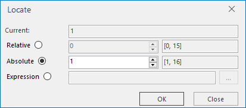

### Description

Locate and view a specific record in the attribute table.

### Basic Steps

  1. Open an attribute table. you can right click a vector dataset in the Workspace Manager and click Browse Attributes. Or double-click the pure attribute table dataset
  2. On the Attributes tab, in the Browse group, click Locate to display the Locate dialog box, in which the current position of the cursor is display and you can specify to move to any record in the table. You can locate a record by specifying a relative or absolute position, or an expression. 

Check the corresponding radio button to select a method.

    * Relative: Move from the current location to the relative position any number of rows up or down. A positive value value indicates how many rows the cursor will be moved up from the current location while a negative ones indicates how many rows down.
    * Absolute: Move to a specific record number.
    * Filter: Locate records satisfying specific conditions. Check the Filter radio button to enable the button with the ellipse to the right, click the button to display the SQL Expression dialog box, configure the conditions for record location.
  
 
  3. Click OK to locate.
  4. In the Browse group of the Tabular tab, click the Locate button, and select "Locate to Top" and it will go to the first record of the table. 
  5. In the Browse group of the Tabular tab, click the Locate button, and select "Locate to Bottom" and it will go to the last record of the table. 

### Note

  1. The current, relative, and absolute positions in the attribute table are all concepts related to rows instead of fields.
  2. You can use the Up and Down keys to move up or down to other records. 
  3. For Oracle and SQL datasources, it is not supported to locate to record by using Equal condition on two binary fields. 
  4. The Locate dialog box is a non-modal window, so you can set the parameters by directly selecting rows in the attribute table.

 [Sort Ascending](SortOrderAscendingButton.htm)

 [Sort Descending](SortOrderDescendingButton.htm)

 [Hide Column](HideButton.htm)

 [Cancel Hide](CancelHideButton.htm)

 [Filter](FilterButton.htm)

